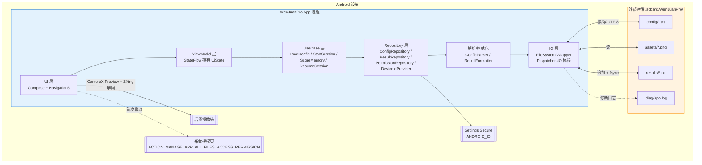
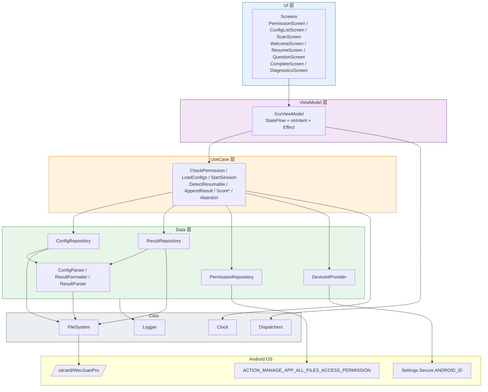
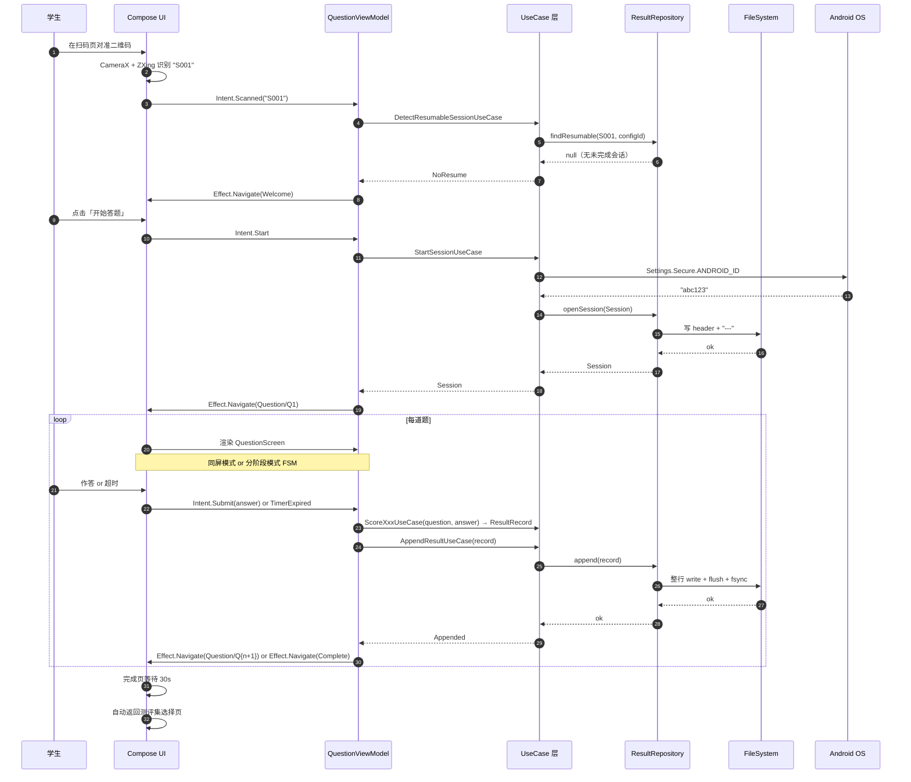
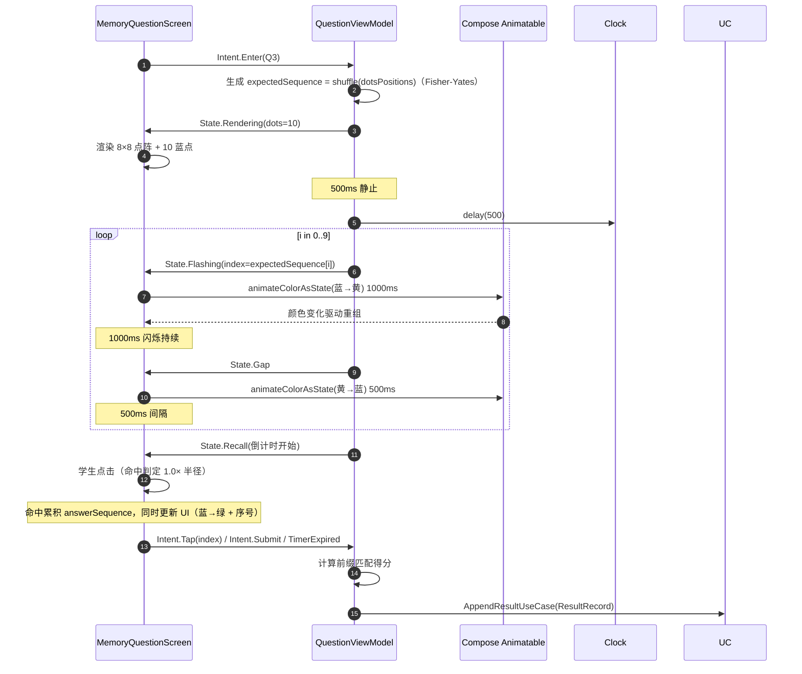
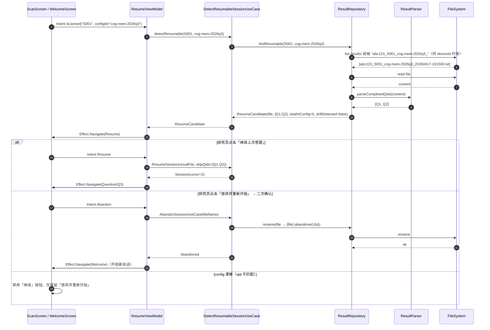
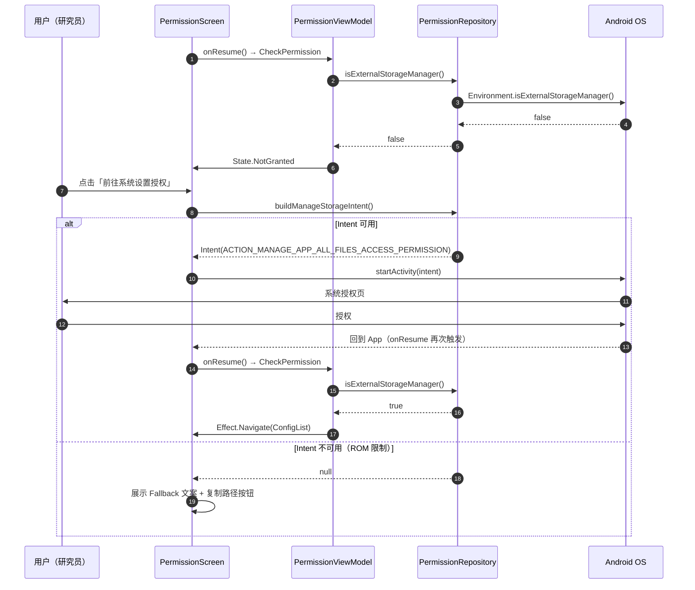
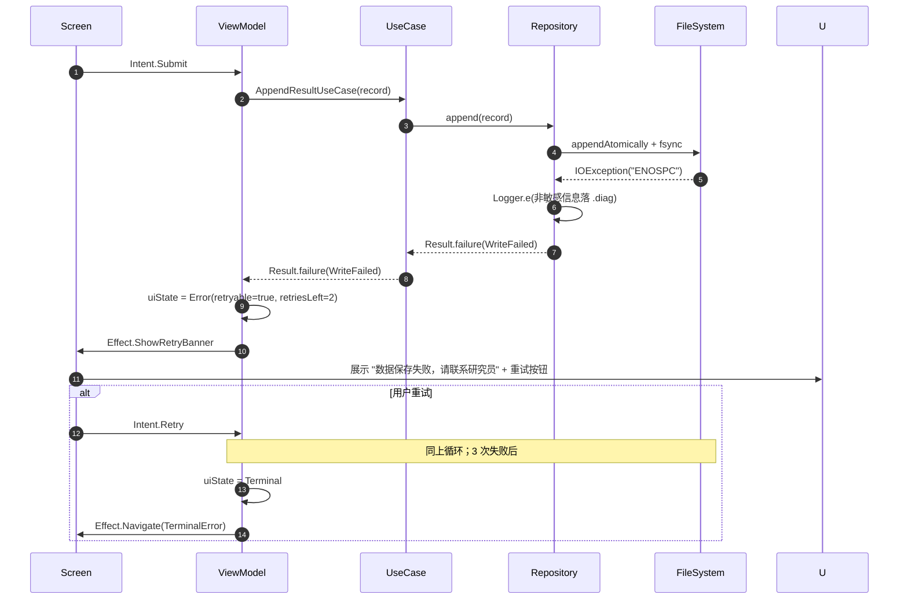

# WenJuanPro 全栈架构文档

> 版本: v1.1 · 日期: 2026-04-17 · 作者: 鲁班（架构师） · 模式: draft-first
>
> 输入: `docs/project-brief.md` v0.2 + `docs/prd.md` v1.0 + `docs/front-end-spec.md` v1.0
>
> **适用说明**: 本文档虽沿用 `fullstack-architecture` 模板骨架，但 WenJuanPro 是**单仓 Android 原生离线 App**——不含后端服务、不含 Web 前端、不连互联网。模板中「后端 / API / 部署 / 监控云服务」相关章节**已折叠为 N/A 并附说明**，工程焦点集中于：Android 应用架构、UI 数据流、TXT 解析/写入、会话状态机、文件 IO、权限模型、模块/包结构、错误恢复、测试策略。

---

## 引言

本文档定义了 WenJuanPro 的完整技术架构。由于 App 完全离线运行、所有数据经由本地 TXT 文件持久化，「前端（Compose UI）」与「后端（文件 IO + 解析器 + 评分器）」在同一进程内以分层方式共存；因此本文档在「全栈」一词的含义上指的是**UI 层 ↔ 业务逻辑层 ↔ 文件 IO 层**的端到端统一方案，而非 Web 意义上的前后端分离。

本文档是 AI 驱动开发（SM → Dev → QA）的唯一技术真实来源；所有 Story 的实现必须依从此处定义的分层、模块、命名与契约。

### 启动模板或现有项目

**N/A —— 全新（greenfield）项目**。不基于任何启动模板。工程骨架由 Android Studio（Electric Eel 或更新，Koala+）生成的 Empty Compose Activity 模板起步，经本架构定义的模块切分与依赖配置改造后形成 `app` 单模块结构（第二阶段再拆 feature module）。

### 变更日志

| 日期       | 版本 | 描述                                                                                                                              | 作者 |
|------------|------|-----------------------------------------------------------------------------------------------------------------------------------|------|
| 2026-04-17 | v1.0 | 基于 project-brief v0.2 + prd v1.0 + front-end-spec v1.0 的首版定稿；适配为 Android 单仓离线架构，折叠后端/API/部署章节为 N/A     | 鲁班 |
| 2026-04-17 | v1.1 | 用户决策定稿：扫码单押 ZXing（移除 ML Kit）；IO 保留 java.nio+Okio 双栈；跨设备不续答；D-H 全默认。明确 config 支持混排题型不限数量。 | 鲁班 |

---

## 高层架构

### 技术概述

WenJuanPro 采用 **单体 Android 原生架构 + MVI 单向数据流**，基于 Kotlin + Jetpack Compose（Material 3）+ Compose Animation 构建；所有持久化经由固定路径 `/sdcard/WenJuanPro/{config,assets,results,.diag}/` 下的 TXT / 图片文件完成，**无数据库、无后端、无网络**。UI 层（Composables + Navigation）通过 `ViewModel` 持有 `StateFlow<UiState>`，向业务逻辑层（`UseCase`）发 `Intent` 并接收 `Effect`；业务逻辑层依赖两个核心 Repository（`ConfigRepository` / `ResultRepository`）完成文件系统读写；动画与时序完全依赖 Compose 高层 API（`Animatable`、`animate*AsState`、`InfiniteTransition`），不使用 `Choreographer` 或 `withFrameNanos`。该架构以"最少活动部件 + 单一事实源（TXT）+ 严格分层"直接对齐 PRD 的 ±50ms 时序抖动、≥ 99.5% 数据完整率、100% 断点恢复三大核心 NFR。

### 平台与基础设施选择

**平台:** Android OS（API 26 至 API 34）  
**核心服务:** 仅 Android 系统 API（`Settings.Secure.ANDROID_ID` / `CameraX`（仅预览） / `MANAGE_EXTERNAL_STORAGE` / `Environment.getExternalStorageDirectory()`）；无云服务、无 Google Play Services  
**部署主机与区域:** N/A —— APK 通过 U 盘 / 微信 / 内部分发链接手动侧载；不上架任何应用市场  
**数据主权:** 全程驻留于本地外部存储；App 不发起任何网络请求（编译期依赖白名单守门）

### 仓库结构

**结构:** 单仓（Monorepo = No, Polyrepo = No；即单一 Git 仓库 `WenJuanPro/`）  
**Monorepo 工具:** N/A  
**包组织方式:** 初期单 Gradle 模块 `app/`，按 Kotlin package 按职责分层（`ui` / `feature` / `domain` / `data` / `core`）；第二阶段按认知范式题型拆 feature module（`feature-memory`、`feature-nback` 等）

### 高层架构图



### 架构模式

- **MVI（Model-View-Intent）单向数据流:** UI → Intent → Reducer → State → UI。_理由:_ Compose 声明式范式天然契合不可变状态；单向流降低作答流程（倒计时 × 异步 IO × 动画）的状态错乱风险。
- **分层架构（UI / Domain / Data）:** UI 层仅依赖 ViewModel；ViewModel 仅依赖 UseCase；UseCase 仅依赖 Repository 接口。_理由:_ 文件 IO 可替换为假实现以支持单元测试；解析器与格式化器可脱离 Android runtime 在 JVM 上测试。
- **Repository 模式:** `ConfigRepository` / `ResultRepository` / `PermissionRepository` 抽象所有外部存储与系统 API 访问。_理由:_ 屏蔽 TXT 格式与文件系统 API 的演进；为断点续答、诊断工具等横切功能提供统一入口。
- **单一事实源（Single Source of Truth = TXT 文件）:** 不引入 Room / SQLite，避免"内存状态 / DB / 文件"三态双写。_理由:_ 研究员诉求是"TXT 双向可读写"；任何本地 DB 都会制造同步复杂度与调试盲点。
- **有限状态机（FSM）驱动作答流程:** 题目级与会话级两层 FSM；题目级状态（Staged 模式下的 Stem / Options 阶段）由 ViewModel 持有，会话级状态（授权 / 选题 / 扫码 / 续答 / 作答 / 完成）由 Navigation 持有。_理由:_ 使"题干超时自动进入选项阶段"、"半完成题整题重做"等规则可以用表驱动方式显式建模并单测覆盖。
- **原子追加写入（Atomic Append）:** 每行结果在内存组装完整后一次性 `write + flush + fsync`，不分段落笔。_理由:_ 满足 NFR12「强杀不出现半行」；避免续答时解析到半行导致误判。
- **依赖注入（Hilt）:** Repository / UseCase / ViewModel 由 Hilt 图注入。_理由:_ 便于测试替身；保持 ViewModel 构造函数显式依赖。
- **Immutable Config Snapshot:** Config 解析完成后以 `data class` 冻结；整个测评会话引用同一实例，避免 config 文件在作答期间被改动造成 FSM 漂移。

---

## 技术栈

此表为整个 WenJuanPro 项目的**技术唯一真实来源**。Dev Agent 必须严格依从此版本，任何偏差须经 Architect 评审。

### 技术栈表

| 类别              | 技术                                    | 版本                | 用途                                       | 选择理由                                                                                 |
|-------------------|-----------------------------------------|---------------------|--------------------------------------------|------------------------------------------------------------------------------------------|
| 客户端语言        | Kotlin                                  | 1.9.24              | App 全部业务代码                           | Android 官方主推；与 Compose 深度集成；协程与 Flow 原生支持                                |
| UI 框架           | Jetpack Compose                         | BOM 2024.09.02      | 声明式 UI                                  | 贴合 MVI 单向流；`Animatable` 满足 ±50ms 时序抖动；与 Material 3 无缝衔接                 |
| Compose Compiler  | Compose Compiler Gradle Plugin          | 1.5.14              | Compose 代码生成                           | 匹配 Kotlin 1.9.24                                                                       |
| UI 组件库         | Material 3 (Compose)                    | BOM 2024.09.02      | Scaffold / Card / Button / Icon            | PRD 指定默认浅色主题；零品牌诉求                                                           |
| 导航              | AndroidX Navigation-Compose             | 2.8.0               | Screen 路由 + 返回键策略                   | 与 Compose NavHost 无缝；支持 `NavBackStackEntry` 上的 SavedStateHandle                    |
| 状态管理          | StateFlow + MVI                         | Kotlin 1.9 内置     | ViewModel 持有 `StateFlow<UiState>`        | 无需引入额外库；可在 ViewModel 中用 `update { }` 安全修改                                   |
| 依赖注入          | Hilt                                    | 2.52                | Repository / UseCase / ViewModel 图        | Android 官方推荐；编译期校验；Compose Navigation Hilt 模块直接注入 ViewModel                |
| 协程              | kotlinx.coroutines                      | 1.8.1               | IO 调度 + 动画驱动的 `launch` 上下文       | `Dispatchers.IO` 执行文件 IO；`viewModelScope` 管理 UI 生命周期                              |
| 序列化            | kotlinx.serialization                   | 1.7.2               | 内存数据结构序列化（诊断日志/测试替身）     | 官方库；不需要额外反射                                                                      |
| 文件 IO           | `java.nio.file` + Okio 3.9.0 (可选)     | Okio 3.9.0          | UTF-8 行式读写 + fsync                     | `Okio.BufferedSink.flush()` + `FileChannel.force(false)` 保证 fsync；API 简洁可测试         |
| 扫码              | CameraX + ZXing Android Embedded        | CameraX 1.3.4 / ZXing-Android-Embedded 4.3.0 | 后置摄像头预览 + 二维码识别 | 纯本地解码，不依赖 Google Play Services，完全贴合离线定位；CameraX 提供预览帧，ZXing 做纯 CPU 解码 |
| 动画              | Compose Animation（高层 API）           | 随 Compose BOM      | 闪烁 / 倒计时进度条 / 阶段切换淡入淡出      | 仅用 `Animatable`、`animate*AsState`、`InfiniteTransition`；禁用 Choreographer              |
| 日志              | Timber + 自定义 FileTree                 | Timber 5.0.1        | 分级日志 + 落盘到 `.diag/app.log`          | Timber 轻量；自定义 FileTree 仅记录非答题明文的诊断信息                                     |
| CSS 框架          | N/A                                     | —                   | —                                          | 无 Web UI                                                                                   |
| 前端语言          | N/A（使用 Kotlin + Compose）             | —                   | —                                          | 无 Web 前端                                                                                 |
| 后端语言          | **N/A**                                 | —                   | —                                          | 全离线 App，无后端                                                                          |
| 后端框架          | **N/A**                                 | —                   | —                                          | 同上                                                                                        |
| API 风格          | **N/A**                                 | —                   | —                                          | 无 API；"契约"形态为 TXT Schema（见下文「文件存储 Schema」）                                |
| 数据库            | **N/A**                                 | —                   | —                                          | 单一事实源为 TXT 文件，刻意不引入 Room/SQLite                                                |
| 缓存              | 进程内内存缓存（`StateFlow` / `val`）    | —                   | Config 解析结果缓存                        | 进程生命周期内的不可变快照；页面重进时按需读取                                                |
| 文件存储          | Android 外部存储（`MANAGE_EXTERNAL_STORAGE`） | 系统 API            | config / assets / results / .diag          | PRD 强约束：固定路径 `/sdcard/WenJuanPro/`                                                 |
| 认证              | N/A（扫码即学号）                        | —                   | —                                          | 无账户体系；二维码内容 = studentId                                                            |
| 客户端测试 (JVM)  | JUnit 4 + MockK + kotlinx-coroutines-test | JUnit 4.13.2 / MockK 1.13.13 | 解析器 / 状态机 / 评分器单测     | 纯 JVM 可执行；不依赖 Android framework                                                       |
| 客户端测试 (Android) | Robolectric + AndroidX Test            | Robolectric 4.13    | Repository / 权限分支 / SSAID 获取集成测试 | Robolectric 在 JVM 中模拟 Android runtime，避免每次跑 instrumented test                        |
| UI 测试           | Compose UI Test + Espresso              | 随 Compose BOM / Espresso 3.6.1 | 1-2 条「扫码 → 作答 → 落盘 → 续答」主路径 UI 测试 | 关键路径用 instrumented test 在真机/模拟器跑；记忆题时序不纳入自动化（依赖人工实测）           |
| E2E 测试          | **N/A**                                 | —                   | —                                          | 单 Activity + 单进程 App，UI 测试已覆盖关键 E2E 路径                                         |
| 构建工具          | Gradle (KTS)                            | 8.7                 | Android 项目构建                           | Android Studio 默认；AGP 8.5.2                                                                |
| 打包工具          | Gradle + R8                             | 随 AGP              | APK 打包 + 代码缩减                         | Release 构建启用 R8 缩减 + 代码混淆；Debug 构建关闭                                           |
| IaC 工具          | **N/A**                                 | —                   | —                                          | 无服务端基础设施                                                                               |
| CI/CD             | GitHub Actions（或 Gitea Runner）        | —                   | Lint + 单测 + APK 打包                      | 不部署线上环境；仅产出 Debug / Release APK 作为工件                                            |
| 监控              | Timber 本地日志 + 诊断页                 | —                   | 崩溃 stacktrace 落盘 `.diag/`              | 无 Firebase / Sentry 等外发上报，保证离线原则                                                 |
| 日志             | Timber FileTree → `/sdcard/WenJuanPro/.diag/app.log` | —       | 诊断与崩溃现场                             | 日志不得包含答题明文（NFR9）                                                                   |

**扫码引擎决策（v1.1 锁定）:** 单押 ZXing Android Embedded 4.3.0；**不引入 ML Kit Barcode Scanning**，原因：ML Kit 依赖 Google Play Services 动态下发模型，与本 App"完全离线、零 Google 依赖"定位冲突。CameraX 仅负责摄像头预览帧获取，ZXing 做纯 CPU 解码。

**图像加载:** Coil 2.7.0（可选，仅当 `assets/*.png` 单张 > 200KB 时启用；当前 MVP 图片较小，直接用 `BitmapFactory` 即可）。

---

## 数据模型

WenJuanPro 的核心数据模型均为**内存不可变数据**（`data class`），由解析器从 TXT 生成，由格式化器序列化写回 TXT。所有模型均放在 `:app` 模块的 `domain.model` 包下，不依赖 Android Framework，可直接在 JVM 单测中验证。

### Config

**用途:** 单个测评集的不可变快照，由 `/sdcard/WenJuanPro/config/{name}.txt` 解析而来。

**核心设计约束（v1.1 锁定）:** 一份 config.txt 支持配置**不限数量**的题目（`[Q1]`、`[Q2]`、`[Q3]`…），且**题型可任意混排**——单选（`single`）、多选（`multi`）、记忆闪烁点击题（`memory`）可以出现在同一份 config 中，以研究员指定的顺序依次呈现。`questions: List<Question>` 中的每个元素是 `Question` sealed interface 的三种具体实现之一，由解析器根据每道题的 `type` 字段动态派发。

**关键属性:**

- `configId`: String — 1-64 字符，仅 `[A-Za-z0-9_-]+`；缺失时回退为文件名（去 `.txt`）
- `title`: String — 展示给学生与研究员的标题
- `sourceFileName`: String — 源 TXT 文件名
- `questions`: List\<Question\> — 按 TXT 中 `[Q1] [Q2] …` 的出现顺序；**题型混排，不限数量**
- `parseWarnings`: List\<ConfigWarning\> — 如 BOM 存在等非致命警告

#### Kotlin 数据类

```kotlin
data class Config(
    val configId: String,
    val title: String,
    val sourceFileName: String,
    val questions: List<Question>,
    val parseWarnings: List<ConfigWarning> = emptyList(),
) {
    val totalDurationMs: Long
        get() = questions.sumOf { it.totalDurationMs }
}

data class ConfigWarning(val line: Int, val message: String)
```

#### 关系

- `Config` **聚合** `Question`（父子）
- `Config` **被** `Session` 引用（一对多：同 config 可被多位学生作答，各产生独立 Session）

### Question（sealed class）

**用途:** 题目多态，覆盖单选 / 多选 / 记忆三种题型；同屏（`all_in_one`）与分阶段（`staged`）呈现模式体现在倒计时字段上。

#### Kotlin 数据类

```kotlin
sealed interface Question {
    val qid: String              // "Q1", "Q2", ...
    val mode: PresentMode        // ALL_IN_ONE | STAGED
    val stemDurationMs: Long?    // 仅 STAGED 模式下非空
    val optionsDurationMs: Long  // 同屏模式下代表整题倒计时
    val totalDurationMs: Long
        get() = (stemDurationMs ?: 0L) + optionsDurationMs

    data class SingleChoice(
        override val qid: String,
        override val mode: PresentMode,
        override val stemDurationMs: Long?,
        override val optionsDurationMs: Long,
        val stem: StemContent,
        val options: List<OptionContent>,
        val correctIndex: Int,           // 1-based
        val scores: List<Int>,           // size == options.size
    ) : Question

    data class MultiChoice(
        override val qid: String,
        override val mode: PresentMode,
        override val stemDurationMs: Long?,
        override val optionsDurationMs: Long,
        val stem: StemContent,
        val options: List<OptionContent>,
        val correctIndices: Set<Int>,    // 1-based
        val scores: List<Int>,
    ) : Question

    data class Memory(
        override val qid: String,
        override val mode: PresentMode,
        override val stemDurationMs: Long?,
        override val optionsDurationMs: Long,  // 这里是"复现阶段"倒计时
        val dotsPositions: List<Int>,    // 恰好 10 个，0..63，互不重复
        val flashDurationMs: Long = 1000L,
        val flashIntervalMs: Long = 500L,
    ) : Question
}

enum class PresentMode { ALL_IN_ONE, STAGED }

sealed interface StemContent {
    data class Text(val text: String) : StemContent
    data class Image(val assetName: String) : StemContent
    data class Mixed(val text: String, val assetName: String) : StemContent
}

sealed interface OptionContent {
    data class Text(val text: String) : OptionContent
    data class Image(val assetName: String) : OptionContent
    data class Mixed(val text: String, val assetName: String) : OptionContent
}
```

#### 关系

- `Question` 被 **渲染** 为对应 Composable 作答页（见「UI 层组件架构」）
- `Question` 的正确答案 / 得分**永不呈现给学生**，仅在 `ResultRecord` 中写入供研究员比对

### Session

**用途:** 一次测评从扫码开始到完成的运行时上下文；生命周期绑定 NavHost 的 Session 图；异常终止后由断点续答恢复。

#### Kotlin 数据类

```kotlin
data class Session(
    val studentId: String,            // 扫码所得
    val deviceId: String,             // Settings.Secure.ANDROID_ID
    val config: Config,
    val sessionStart: LocalDateTime,  // 点击「开始答题」瞬时
    val resultFileName: String,       // {deviceId}_{studentId}_{configId}_{yyyyMMdd-HHmmss}.txt
    val cursor: Int,                  // 指向下一道待作答题的 index，断点续答时 > 0
    val completedQids: Set<String>,   // 已 done/not_answered/error 的 qid
)
```

#### 关系

- `Session` **引用** `Config`（不可变快照）
- `Session` **拥有** 一个结果文件（一对一）

### ResultRecord

**用途:** 结果 TXT 的一条业务行（header 下方）；管道分隔；由 `ResultFormatter` 序列化，由 `ResultRepository.append()` 追加。

#### Kotlin 数据类

```kotlin
data class ResultRecord(
    val qid: String,
    val type: QuestionType,         // SINGLE | MULTI | MEMORY
    val mode: PresentMode,
    val stemMs: Long?,              // all_in_one 模式为 null，序列化为 "-"
    val optionsMs: Long,
    val answer: String,             // 单选: "2"；多选: "1,3"；记忆: "3,7,22,12,..."; 未答: ""
    val correct: String,            // 同格式
    val score: Int,
    val status: ResultStatus,       // DONE | NOT_ANSWERED | PARTIAL | ERROR
)

enum class QuestionType { SINGLE, MULTI, MEMORY }
enum class ResultStatus { DONE, NOT_ANSWERED, PARTIAL, ERROR }
```

#### 关系

- `ResultRecord` 与 `Question` 一一对应（通过 `qid` 关联）

---

## API 规格

**N/A —— 无网络 API。**

WenJuanPro 不与任何后端服务交互，也不对外暴露 API；App 间与进程间均不通信。模板中"API 契约"在本项目对应**文件存储 Schema**（`config/*.txt` 与 `results/*.txt` 的行式格式定义），见下一节「文件存储 Schema」——所有 Story 的输入/输出契约均在此锚定。

---

## 文件存储 Schema

此节替代传统「API 契约 + 数据库 Schema」，是 Dev / QA / 研究员三方共识的硬性契约。任何对下述格式的修改**必须**经 Architect 发起 TCP（Technical Change Proposal）。

### 目录布局

```text
/sdcard/WenJuanPro/
├── config/          # 研究员预置的 TXT 题库；App 只读
│   └── {anyName}.txt
├── assets/          # 题干 / 选项引用的图片（PNG/JPG）；App 只读
│   └── {fileName}.png
├── results/         # App 追加写入；研究员回收后可读、清理
│   └── {deviceId}_{studentId}_{configId}_{yyyyMMdd-HHmmss}.txt
└── .diag/           # 诊断日志（可选）；不含答题明文
    └── app.log
```

### Config 文件 Schema

**编码:** UTF-8（无 BOM；BOM 存在时解析器告警但仍继续）  
**行尾:** `\n` 或 `\r\n` 均兼容  
**分节:** 以 `[Qn]` 行（`n` 为 1-based 编号）标记题目起始；`[Qn]` 之前的 `# key: value` 行为 Header  
**题目数量与题型混排:** 不限题目数量；每道题通过 `type` 字段独立声明题型（`single` / `multi` / `memory`），同一份 config 中可任意穿插。题目按 `[Q1]` → `[Q2]` → … 的出现顺序呈现给学生

**语法（BNF 风格）:**

```text
config      ::= header '\n' question+
header      ::= ( comment_line | kv_header_line )+
comment_line ::= '#' text '\n'
kv_header_line ::= '#' WS key ':' WS value '\n'
  # 必填 key: configId, title

question    ::= '[Q' digit+ ']' '\n' kv_line+
kv_line     ::= key ':' WS value '\n'

# 所有题目通用 key: type, mode
# all_in_one 模式 key: durationMs
# staged     模式 key: stemDurationMs, optionsDurationMs
# single / multi 题型 key: stem, options, correct, score
# memory 题型 key: dotsPositions(, flashDurationMs, flashIntervalMs — 可选，缺失用默认 1000/500)
# options 值以竖线 | 分隔；支持 "img:filename.png" 前缀表示图片；支持 "img:file.png|文字部分" 混合
```

**示例 — 单选（同屏模式）:**

```text
# configId: cog-mem-2026q3
# title: 认知记忆测评 v1

[Q1]
type: single
mode: all_in_one
durationMs: 30000
stem: 你今天感觉如何？
options: 很好|一般|较差|很差
correct: 1
score: 2|1|0|0
```

**示例 — 多选（分阶段模式）:**

```text
[Q2]
type: multi
mode: staged
stemDurationMs: 10000
optionsDurationMs: 20000
stem: 下面哪些是水果？
options: 苹果|胡萝卜|香蕉|菠菜
correct: 1,3
score: 1|0|1|0
```

**示例 — 记忆题:**

```text
[Q3]
type: memory
mode: all_in_one
optionsDurationMs: 20000
dotsPositions: 3,7,12,19,22,30,37,44,51,58
# 可选（缺失则硬编码默认）:
# flashDurationMs: 1000
# flashIntervalMs: 500
```

**Schema 校验规则:** 详见 PRD Story 1.3 `data_validation` 与 `error_handling` 章节；所有错误必须包含行号、字段、原因三要素。

### Result 文件 Schema

**文件名:** `{deviceId}_{studentId}_{configId}_{yyyyMMdd-HHmmss}.txt`  
**编码:** UTF-8（无 BOM）  
**结构:** Header（key:value 行）→ `---` 分隔行 → 业务行（每题一行，管道分隔）

**Header 示例:**

```text
deviceId: abc123def456
studentId: S001
configId: cog-mem-2026q3
sessionStart: 20260417-103045
appVersion: 0.1.0
---
```

**业务行格式（每题一行，9 字段，`|` 分隔）:**

```text
qid | type | mode | stemMs | optionsMs | answer | correct | score | status
```

- `type`: `single` / `multi` / `memory`
- `mode`: `all_in_one` / `staged`
- `stemMs`: `staged` 模式下为毫秒数；`all_in_one` 模式写 `-`
- `answer` / `correct`:
  - 单选: `"2"` / `"1"`
  - 多选: `"1,3"` / `"1,3"`（逗号分隔，升序）
  - 记忆: `"3,7,22,..."` / `"7,22,3,..."`（学生复现顺序 vs 本次闪烁顺序）
  - 未答: `""`
- `status`: `done` / `not_answered` / `partial` / `error`
  - **注**: 依 PRD BR-2.5 规则，`staged` 模式只在整题结束（选项阶段提交/超时/异常）时写入一行；**运行中的 `partial` 不会落到文件**，以简化续答语义

**业务行示例:**

```text
Q1|single|all_in_one|-|24530|2|1|0|done
Q2|multi|staged|10000|8420|1,3|1,2|1|done
Q3|memory|all_in_one|-|18200|3,7,22,12,19,30,37,44,51,58|7,22,3,12,19,30,37,44,51,58|8|done
Q4|single|all_in_one|-|30000||2|0|not_answered
```

### 断点续答探测规则

- **同设备约束（v1.1 锁定）:** 仅匹配 `{当前deviceId}_{studentId}_{configId}_` 前缀的文件；不同 `deviceId` 的文件**视为不存在**，即**跨设备不续答**（语义最清晰，避免学生换设备后出现"别人的进度"干扰）
- 若匹配多个文件（理论上不应出现——同设备同学号同 config 已有完成文件时视为全部完成）——取 `sessionStart` 最晚的一份
- 已完成 qid = 文件中所有 `status ∈ {done, not_answered}` 的行（`error` 与缺失视为未完成）
- config 漂移检测：若文件中出现的 qid 不是 config 的前缀子集（如 qid 重命名、题目数量变更），禁用「继续上次答题」按钮

---

## 组件

App 按分层职责划分为以下逻辑组件；括号内为 Kotlin package。

### UI 层

**职责:** Compose Composable 与 Navigation 路由；不持有业务状态。

**关键接口:**

- `@Composable fun WenJuanProApp()`: 根 Composable，托管 NavHost + Theme
- `NavGraph`: 声明所有 Screen 之间的路由与参数传递

**依赖:** `ViewModel` 层（通过 `hiltViewModel()` 注入）

**技术栈:** Compose (BOM 2024.09.02) + Navigation-Compose 2.8.0 + Material 3

**Package:** `ai.wenjuanpro.app.ui.{theme, components, screens.{permission, configlist, scan, welcome, resume, question, complete, diagnostics}}`

### ViewModel 层

**职责:** 持有 `StateFlow<UiState>`；接收 UI 发出的 `Intent`；调用 UseCase；产生 `Effect`（一次性导航 / Toast / 震动）。

**关键接口:**

- `PermissionViewModel` / `ConfigListViewModel` / `ScanViewModel` / `WelcomeViewModel` / `ResumeViewModel` / `QuestionViewModel` / `CompleteViewModel` / `DiagnosticsViewModel`
- 每个 VM 暴露 `uiState: StateFlow<UiState>`, `onIntent(intent: Intent)`, `effects: Flow<Effect>`

**依赖:** UseCase 层

**技术栈:** Kotlin Coroutines 1.8.1 + Hilt 2.52

**Package:** `ai.wenjuanpro.app.feature.{domain}.vm`

### UseCase 层

**职责:** 单一业务用例的组合逻辑；无状态，可多次调用；不感知 Android Framework（除必要的 `Settings.Secure`）。

**主要 UseCase:**

- `CheckPermissionUseCase`
- `LoadConfigsUseCase` — 触发 `ConfigRepository.loadAll()`；聚合有效/损坏结果
- `StartSessionUseCase` — 生成 `Session`，创建 result 文件并写 header
- `DetectResumableSessionUseCase` — 扫描 `results/` 匹配当前 `studentId + configId`
- `AppendResultUseCase` — 将 `ResultRecord` 原子追加入当前 session 文件
- `ScoreSingleChoiceUseCase` / `ScoreMultiChoiceUseCase` / `ScoreMemoryUseCase`
- `AbandonSessionUseCase` — 放弃续答时重命名旧文件为 `.abandoned.{ts}`

**依赖:** Repository 层

**Package:** `ai.wenjuanpro.app.domain.usecase`

### Data / Repository 层

**职责:** 文件系统与 Android 系统 API 的唯一访问入口。

**关键组件:**

- `ConfigRepository`
  - `suspend fun loadAll(): List<ConfigLoadResult>`（IO Dispatcher）
  - `ConfigLoadResult` = `Valid(Config)` | `Invalid(fileName, errors: List<ParseError>)`
- `ResultRepository`
  - `suspend fun openSession(session: Session)`（写 header）
  - `suspend fun append(record: ResultRecord)`（整行 build → write → flush → fsync）
  - `suspend fun findResumable(studentId: String, configId: String): ResumeCandidate?`
  - `suspend fun abandon(fileName: String)`
- `PermissionRepository`
  - `fun isExternalStorageManager(): Boolean`
  - `fun buildManageStorageIntent(): Intent?`
- `DeviceIdProvider`
  - `fun getSsaid(): String`（失败抛 `SsaidUnavailableException`）

**依赖:** `ConfigParser` / `ResultFormatter` / `FileSystem`

**Package:** `ai.wenjuanpro.app.data.{config, result, permission, device}`

### Parser / Formatter

**职责:** TXT 与内存数据结构的双向转换；纯 Kotlin，可在 JVM 单测运行。

**关键组件:**

- `ConfigParser`
  - `fun parse(sourceName: String, text: String): ParseResult`
  - `ParseResult` = `Success(Config)` | `Failure(errors: List<ParseError>)`
  - `ParseError(line: Int, field: String?, code: ParseErrorCode, message: String)`
- `ResultFormatter`
  - `fun formatHeader(session: Session): String`
  - `fun formatRecord(record: ResultRecord): String`
- `ResultParser`（仅续答场景使用）
  - `fun parseCompletedQids(text: String): Set<String>`

**依赖:** 无（纯 Kotlin stdlib）

**Package:** `ai.wenjuanpro.app.data.parser`

### Core / Infrastructure

**职责:** 分层之间共享的基础设施。

**关键组件:**

- `FileSystem`（对 `java.io.File` / `Okio` 的薄封装）—— 便于测试用假实现
- `Dispatchers`（`@IoDispatcher` / `@MainDispatcher` 注解 + Hilt 模块）
- `Clock`（`fun nowMs(): Long`；可替换为测试时钟）
- `Logger`（Timber 封装）

**Package:** `ai.wenjuanpro.app.core.{io, concurrency, time, log}`

### 组件图



---

## 外部 API

**N/A —— App 不调用任何外部 API。**

以下系统级 API 为架构依赖（非网络 API）：

- `Settings.Secure.ANDROID_ID`（读取 SSAID 作为 deviceId）
- `Environment.isExternalStorageManager()` / `ACTION_MANAGE_APP_ALL_FILES_ACCESS_PERMISSION`（权限检测与请求）
- `CameraX` + `ZXing`（扫码；纯本地 CPU 解码，不依赖 Google Play Services）
- Android Keystore 用于 APK 签名（仅构建期，非运行时）

---

## 核心工作流

### 工作流 1: 学生完成一次测评（新会话，含记忆题）



### 工作流 2: 记忆题闪烁序列（时序关键）



### 工作流 3: 断点续答



### 工作流 4: MANAGE_EXTERNAL_STORAGE 授权



---

## 数据库 Schema

**N/A —— 无数据库。**

WenJuanPro 刻意不引入 Room/SQLite。持久化唯一形态见上文「文件存储 Schema」。任何引入本地数据库的提议必须先走 TCP 评估"TXT 双写一致性"成本，并由研究员确认不会破坏"直接改 TXT 即可发布"这一核心产品承诺。

---

## 前端架构（Android UI）

> 说明：本节对应模板「Frontend Architecture」，在 WenJuanPro 语境下指 **Android Compose UI 层** 的组织与模式。

### 组件架构

#### Composable 组织

```text
ui/
├── theme/
│   ├── Theme.kt                 # Material 3 默认浅色 + Primary=#1976D2 + Warning=#FB8C00
│   ├── Color.kt
│   └── Typography.kt            # 题干 22sp / 选项 18sp / Caption 14sp（front-end-spec 指定）
├── components/
│   ├── CountdownBar.kt          # 顶部进度条（Primary → 橙色阈值 5s）
│   ├── OptionCard.kt            # 选项卡片（文字 / 图片 / 混合三种形态）
│   ├── DotGrid.kt               # 8×8 网格容器
│   ├── DotCell.kt               # 单个点（空 / 蓝 / 闪烁黄 / 选中绿）
│   ├── AssessmentCard.kt        # 测评集卡片（有效/损坏 + 徽标）
│   ├── ErrorSheet.kt            # 损坏 config 错误详情 BottomSheet
│   └── HiddenLongPressArea.kt   # 右上角 5s 长按触发诊断页
└── screens/
    ├── permission/PermissionScreen.kt
    ├── configlist/ConfigListScreen.kt
    ├── scan/ScanScreen.kt
    ├── welcome/WelcomeScreen.kt
    ├── resume/ResumeScreen.kt
    ├── question/
    │   ├── QuestionScreen.kt              # Router：根据 Question 类型 + 阶段分发
    │   ├── SingleChoiceScreen.kt
    │   ├── MultiChoiceScreen.kt
    │   ├── MemoryQuestionScreen.kt        # 闪烁 + 复现阶段
    │   └── StagedQuestionScaffold.kt      # 分阶段模式的题干↔选项淡入淡出
    ├── complete/CompleteScreen.kt
    └── diagnostics/DiagnosticsScreen.kt
```

#### Composable 模板

```kotlin
@Composable
fun QuestionScreen(
    viewModel: QuestionViewModel = hiltViewModel(),
) {
    val state by viewModel.uiState.collectAsStateWithLifecycle()
    val effects = viewModel.effects

    LaunchedEffect(Unit) {
        effects.collect { effect ->
            when (effect) {
                is Effect.NavigateNext -> /* NavController.navigate */
                is Effect.NavigateComplete -> /* ... */
                is Effect.ShowRetryFailure -> /* Toast / Dialog */
            }
        }
    }

    Scaffold(
        topBar = { CountdownBar(progress = state.countdownProgress, isWarning = state.isWarning) },
    ) { padding ->
        when (val q = state.current) {
            is QuestionUiState.Loading -> LoadingIndicator()
            is QuestionUiState.SingleChoiceAllInOne -> SingleChoiceScreen(q, viewModel::onIntent, padding)
            is QuestionUiState.SingleChoiceStaged -> StagedQuestionScaffold(q, viewModel::onIntent, padding)
            is QuestionUiState.MultiChoiceAllInOne -> MultiChoiceScreen(q, viewModel::onIntent, padding)
            is QuestionUiState.MultiChoiceStaged -> StagedQuestionScaffold(q, viewModel::onIntent, padding)
            is QuestionUiState.Memory -> MemoryQuestionScreen(q, viewModel::onIntent, padding)
            is QuestionUiState.Error -> ErrorView(q.message, onRetry = { viewModel.onIntent(Intent.Retry) })
        }
    }

    // 作答期间消费返回键（front-end-spec 返回键策略）
    BackHandler(enabled = true) { /* no-op */ }
}
```

### 状态管理架构

#### 状态结构

```kotlin
sealed interface QuestionUiState {
    val countdownProgress: Float     // 0f..1f
    val isWarning: Boolean           // 剩余 ≤ 5s 时为 true

    data object Loading : QuestionUiState { /*...*/ }
    data class SingleChoiceAllInOne(/* stem, options, selectedIndex, submitEnabled, ... */) : QuestionUiState
    data class SingleChoiceStaged(val stage: Stage, /*...*/) : QuestionUiState
    data class MultiChoiceAllInOne(/* stem, options, selectedIndices, ... */) : QuestionUiState
    data class MultiChoiceStaged(val stage: Stage, /*...*/) : QuestionUiState
    data class Memory(val phase: MemoryPhase, /* dots, flashing, answers, ... */) : QuestionUiState
    data class Error(val message: String) : QuestionUiState

    enum class Stage { STEM, OPTIONS }
    sealed interface MemoryPhase {
        data object Idle : MemoryPhase                 // 进入后 500ms 静止
        data class Flashing(val currentIndex: Int, val flashingDot: Int) : MemoryPhase
        data object Recall : MemoryPhase
    }
}
```

#### 状态管理模式

- **单一 StateFlow / ViewModel**：每个 Screen 对应一个 ViewModel，持有一个 `MutableStateFlow<UiState>`；UI 通过 `collectAsStateWithLifecycle()` 订阅
- **Intent → Reducer → State**：所有 UI 事件以 `sealed interface Intent` 发给 VM；VM 在内部 reducer 中 `_uiState.update { current -> newState }`
- **Effect 通道**：`Channel<Effect>` → `Flow<Effect>`；UI 侧用 `LaunchedEffect` 消费一次性效果（导航 / Toast）
- **savedStateHandle 只保存 `qid` / `configId`**：对 `Config` 本身不走 savedStateHandle（大对象），而是在 VM 启动时从 Repository 重新加载（解析一次性完成，缓存在进程内）
- **会话级状态**：放在 `@ActivityRetainedScoped` 的 `SessionState` Holder（Hilt 提供），跨 Screen ViewModel 共享；进程被杀后由续答流程恢复

### 路由架构

#### 路由组织

```text
navHost (startDestination = "permission")
├── permission/
├── configlist/
├── scan?configId={configId}
├── welcome?studentId={studentId}&configId={configId}
├── resume?studentId={studentId}&configId={configId}&resultFile={resultFile}
├── question/{qid}              # NavBackStackEntry 读取 SessionState 获取 Config + Session
├── complete/
└── diagnostics/                # 隐藏入口（长按 5s）
```

#### 受保护路由模式

所有路由（除 `permission`）在 `NavHost` 外层包裹 `PermissionGate`：若 `isExternalStorageManager() == false` 则强制回 `permission`。

```kotlin
@Composable
fun WenJuanProNavHost(navController: NavHostController) {
    val permViewModel: PermissionViewModel = hiltViewModel()
    val permState by permViewModel.uiState.collectAsStateWithLifecycle()

    LaunchedEffect(permState) {
        if (!permState.granted && navController.currentDestination?.route != "permission") {
            navController.navigate("permission") { popUpTo(0) }
        }
    }

    NavHost(navController, startDestination = "permission") {
        composable("permission") { PermissionScreen() }
        composable("configlist") { ConfigListScreen() }
        // 作答/完成 Screen 消费返回键，详见 BackHandler
        composable("question/{qid}", arguments = listOf(navArgument("qid") { type = NavType.StringType })) {
            QuestionScreen()
        }
        // ... 其他
    }
}
```

### 前端服务层

> 在 WenJuanPro 语境下，"前端服务层" = Composable/VM 到 UseCase 的协程调用边界，不存在 HTTP Client。

#### API 客户端配置

**N/A** —— 无 HTTP 客户端。VM 通过注入的 UseCase 调用 Repository；所有 IO 经 `Dispatchers.IO` 执行。

#### 服务示例（VM 调用 UseCase 的典型形态）

```kotlin
@HiltViewModel
class QuestionViewModel @Inject constructor(
    private val sessionState: SessionStateHolder,
    private val appendResult: AppendResultUseCase,
    private val scoreSingle: ScoreSingleChoiceUseCase,
    private val scoreMulti: ScoreMultiChoiceUseCase,
    private val scoreMemory: ScoreMemoryUseCase,
    @IoDispatcher private val ioDispatcher: CoroutineDispatcher,
    savedStateHandle: SavedStateHandle,
) : ViewModel() {

    private val _uiState = MutableStateFlow<QuestionUiState>(QuestionUiState.Loading)
    val uiState = _uiState.asStateFlow()

    fun onIntent(intent: Intent) {
        when (intent) {
            is Intent.Submit -> viewModelScope.launch {
                val record = when (val q = sessionState.currentQuestion()) {
                    is Question.SingleChoice -> scoreSingle(q, intent.answer)
                    is Question.MultiChoice -> scoreMulti(q, intent.answer)
                    is Question.Memory -> scoreMemory(q, intent.answer as MemoryAnswer)
                }
                withContext(ioDispatcher) { appendResult(record) }
                    .onSuccess { _effects.send(Effect.NavigateNext) }
                    .onFailure { _uiState.update { QuestionUiState.Error("数据保存失败，请联系研究员") } }
            }
            /* ... */
        }
    }
}
```

---

## 后端架构

> **N/A —— 无后端服务。**

WenJuanPro 的"后端"在本项目语境下是 **设备内的 IO + 解析 + 评分层**，已在上文「组件 / UseCase / Repository」中完整定义。此节保留标题以对齐模板，具体内容参见：

- 服务架构 → 见「组件」一节的 UseCase / Repository 拆分
- 数据库架构 → 见「文件存储 Schema」（TXT 行式格式）
- 认证与授权 → **N/A**（无账户）；权限模型改为 Android 运行时权限 + `MANAGE_EXTERNAL_STORAGE`，见「安全与性能 → 安全要求」

### 数据访问层（Repository 实现要点）

```kotlin
class ResultRepositoryImpl @Inject constructor(
    private val fileSystem: FileSystem,
    private val formatter: ResultFormatter,
    private val parser: ResultParser,
    @IoDispatcher private val ioDispatcher: CoroutineDispatcher,
) : ResultRepository {

    override suspend fun append(record: ResultRecord): Result<Unit> =
        runCatching {
            withContext(ioDispatcher) {
                val line = formatter.formatRecord(record) + "\n"
                val path = currentSessionPath
                    ?: error("Session not opened; call openSession() first")
                fileSystem.appendAtomically(path, line.toByteArray(Charsets.UTF_8))
                fileSystem.fsync(path)
            }
        }

    // appendAtomically 内部：RandomAccessFile/FileChannel.write + FileChannel.force(false)
}
```

**原子追加的关键约束（见 NFR12）:**

1. 整行（含尾 `\n`）先在内存拼装，一次性 write；
2. write 返回后调用 `FileChannel.force(false)` 完成 fsync；
3. 不使用 `BufferedWriter` 持有进程级缓冲（避免 App 被杀时尾部丢失）；
4. 目录不存在时自动 `mkdirs()`，并落 `.diag` 日志。

---

## 源码目录

```text
WenJuanPro/
├── .github/
│   └── workflows/
│       └── ci.yml                    # Lint + JVM 单测 + APK 打包
├── app/                              # 唯一 Android 模块
│   ├── build.gradle.kts
│   ├── proguard-rules.pro
│   └── src/
│       ├── main/
│       │   ├── AndroidManifest.xml   # MANAGE_EXTERNAL_STORAGE / CAMERA / 锁 portrait
│       │   ├── java/ai/wenjuanpro/app/
│       │   │   ├── WenJuanProApp.kt                    # Application + @HiltAndroidApp
│       │   │   ├── MainActivity.kt                     # 单 Activity + setContent { WenJuanProApp() }
│       │   │   ├── ui/
│       │   │   │   ├── theme/ (Theme.kt / Color.kt / Typography.kt)
│       │   │   │   ├── components/ (CountdownBar / OptionCard / DotGrid / DotCell / ...)
│       │   │   │   └── screens/ (permission / configlist / scan / welcome / resume / question / complete / diagnostics)
│       │   │   ├── feature/
│       │   │   │   ├── permission/PermissionViewModel.kt
│       │   │   │   ├── configlist/ConfigListViewModel.kt
│       │   │   │   ├── scan/ScanViewModel.kt
│       │   │   │   ├── welcome/WelcomeViewModel.kt
│       │   │   │   ├── resume/ResumeViewModel.kt
│       │   │   │   ├── question/QuestionViewModel.kt
│       │   │   │   ├── complete/CompleteViewModel.kt
│       │   │   │   └── diagnostics/DiagnosticsViewModel.kt
│       │   │   ├── domain/
│       │   │   │   ├── model/ (Config.kt / Question.kt / Session.kt / ResultRecord.kt / ...)
│       │   │   │   ├── usecase/ (LoadConfigs / StartSession / DetectResumable / AppendResult / Score* / Abandon)
│       │   │   │   └── fsm/ (QuestionFsm.kt / ResumeFsm.kt — 表驱动状态机)
│       │   │   ├── data/
│       │   │   │   ├── config/ (ConfigRepository.kt / ConfigRepositoryImpl.kt)
│       │   │   │   ├── result/ (ResultRepository.kt / ResultRepositoryImpl.kt)
│       │   │   │   ├── permission/ (PermissionRepository.kt / PermissionRepositoryImpl.kt)
│       │   │   │   ├── device/ (DeviceIdProvider.kt / DeviceIdProviderImpl.kt)
│       │   │   │   └── parser/ (ConfigParser.kt / ResultFormatter.kt / ResultParser.kt)
│       │   │   ├── core/
│       │   │   │   ├── io/ (FileSystem.kt / OkioFileSystem.kt)
│       │   │   │   ├── concurrency/ (Dispatchers.kt + @IoDispatcher/@MainDispatcher 注解)
│       │   │   │   ├── time/ (Clock.kt / SystemClock.kt)
│       │   │   │   └── log/ (Logger.kt / FileTree.kt)
│       │   │   └── di/
│       │   │       ├── DataModule.kt                    # Repository 绑定
│       │   │       ├── DispatchersModule.kt             # @IoDispatcher / @MainDispatcher
│       │   │       ├── ParserModule.kt
│       │   │       └── SessionModule.kt                 # @ActivityRetainedScoped SessionStateHolder
│       │   └── res/
│       │       ├── values/ (strings.xml / themes.xml)
│       │       └── ...
│       ├── test/                     # JVM 单测（Robolectric + JUnit4 + MockK）
│       │   └── java/ai/wenjuanpro/app/
│       │       ├── data/parser/ConfigParserTest.kt
│       │       ├── data/parser/ResultFormatterTest.kt
│       │       ├── data/parser/ResultParserTest.kt
│       │       ├── domain/fsm/QuestionFsmTest.kt
│       │       ├── domain/usecase/ScoreSingleChoiceUseCaseTest.kt
│       │       ├── domain/usecase/ScoreMemoryUseCaseTest.kt
│       │       ├── domain/usecase/DetectResumableSessionUseCaseTest.kt
│       │       └── data/result/ResultRepositoryImplTest.kt   # 用假 FileSystem 验证原子追加
│       └── androidTest/              # Instrumented / Compose UI 测试
│           └── java/ai/wenjuanpro/app/
│               ├── ui/ScanToAppendE2ETest.kt              # 扫码→单选→落盘→续答主路径
│               └── ui/MemoryQuestionRenderTest.kt         # 记忆题 UI 渲染（时序抖动不自动化）
├── build.gradle.kts                  # 根
├── settings.gradle.kts
├── gradle.properties
├── gradle/libs.versions.toml         # 版本目录（锁版本）
├── docs/
│   ├── project-brief.md
│   ├── prd.md
│   ├── front-end-spec.md
│   └── architecture.md               # 本文件
├── .gitignore
├── .editorconfig                     # ktlint 对齐
└── README.md
```

**关键命名约定:**

- `package`: `ai.wenjuanpro.app.{ui|feature|domain|data|core|di}.…`
- `applicationId`: `ai.wenjuanpro.app`
- `versionCode` / `versionName`: 由 `gradle/libs.versions.toml` 中心化管理；每次 Release 手动递增

---

## 开发工作流

### 本地开发配置

#### 前置条件

```bash
# JDK 17 (AGP 8.5.2 + Kotlin 1.9.24 要求)
java -version    # expected: openjdk 17.x

# Android Studio（Koala 2024.1.1 或更新）或命令行：
# Android SDK (API 26 ~ API 34) + Platform Tools + Build Tools 34.0.0

# 可选：ktlint 本地预提交（CI 也会跑一次）
brew install ktlint
```

#### 初始配置

```bash
# 克隆并进入仓库
git clone <repo-url> WenJuanPro && cd WenJuanPro

# 拉取 Gradle Wrapper 并首次构建（下载依赖）
./gradlew --version
./gradlew :app:dependencies

# 配置测试设备（真机 or 模拟器 API 26+）
adb devices
# 若使用真机：
# 1) 开启开发者模式 + USB 调试
# 2) 首次安装 APK 后手动授权 "全部文件访问"
# 3) 推送示例 config 与 asset：
adb shell mkdir -p /sdcard/WenJuanPro/config /sdcard/WenJuanPro/assets /sdcard/WenJuanPro/results
adb push docs/samples/cog-mem-2026q3.txt /sdcard/WenJuanPro/config/
```

#### 开发命令

```bash
# 启动所有服务 —— N/A（单 App，无服务端）
# 仅启动前端 —— 见下
# 仅启动后端 —— N/A

# 构建 Debug APK
./gradlew :app:assembleDebug

# 安装到已连接的设备
./gradlew :app:installDebug

# 运行 JVM 单元测试
./gradlew :app:testDebugUnitTest

# 运行 Android Instrumented 测试（需连接设备）
./gradlew :app:connectedDebugAndroidTest

# Lint + ktlint 检查
./gradlew ktlintCheck lint

# 清理
./gradlew clean
```

### 环境配置

#### 必需的环境变量

```bash
# 前端 (.env.local) —— N/A（Android App 不读 .env）
# 后端 (.env)        —— N/A
# 共享                —— N/A

# APK 签名（仅 Release 构建期间使用，由 CI 或本地构建机维护）:
export WJP_KEYSTORE_PATH=/path/to/wenjuanpro.keystore
export WJP_KEYSTORE_PASSWORD=******
export WJP_KEY_ALIAS=wenjuanpro
export WJP_KEY_PASSWORD=******
```

App 运行时没有"环境变量"概念；任何运行时可调参数（如 `flashDurationMs` 默认值）均在 Kotlin 源码中硬编码，或在 config TXT 中显式声明（题目级覆盖）。

---

## 部署架构

> **WenJuanPro 无线上环境**。此节保留模板标题，但多数子项 N/A。

### 部署策略

**前端部署:** APK 通过手动侧载（U 盘 / 微信 / 内部分发链接）分发至目标 Android 设备；研究员负责首次授权 `MANAGE_EXTERNAL_STORAGE` 与 `CAMERA`。

- 平台: N/A（无云平台）
- 构建命令: `./gradlew :app:assembleRelease`
- 输出目录: `app/build/outputs/apk/release/app-release.apk`
- CDN/边缘: N/A

**后端部署:** N/A

### CI/CD 流水线

```yaml
# .github/workflows/ci.yml
name: CI
on: [push, pull_request]

jobs:
  verify:
    runs-on: ubuntu-latest
    timeout-minutes: 25
    steps:
      - uses: actions/checkout@v4
      - uses: actions/setup-java@v4
        with:
          distribution: temurin
          java-version: '17'
      - uses: gradle/actions/setup-gradle@v3
      - name: Dependency whitelist guard
        # 硬性守门：禁止引入 OkHttp / Retrofit / Firebase / 统计 SDK（NFR7）
        run: ./scripts/verify-dependencies.sh
      - name: ktlint
        run: ./gradlew ktlintCheck
      - name: Android Lint
        run: ./gradlew :app:lintDebug
      - name: JVM unit tests
        run: ./gradlew :app:testDebugUnitTest
      - name: Assemble Debug APK
        run: ./gradlew :app:assembleDebug
      - uses: actions/upload-artifact@v4
        with:
          name: wenjuanpro-debug-apk
          path: app/build/outputs/apk/debug/*.apk
```

> **注:** `scripts/verify-dependencies.sh` 在 `./gradlew :app:dependencies` 输出中对 `okhttp|retrofit|firebase|mlkit|gms|umeng|bugly|sentry|hockeyapp|matrix` 等关键字做 grep 阻断。

### 环境

| 环境       | 前端 URL | 后端 URL | 用途                                      |
|------------|----------|----------|-------------------------------------------|
| 开发       | N/A      | N/A      | 研究员/开发者连接设备真机本地运行 Debug APK |
| 预发       | N/A      | N/A      | 研究员在自己设备上先跑一次样例题库验收      |
| 生产       | N/A      | N/A      | 现场测评（Release APK 由研究团队自行分发）  |

---

## 安全与性能

### 安全要求

**前端安全（Android App）:**

- **外部存储授权:** `MANAGE_EXTERNAL_STORAGE` 须由用户在系统设置中显式授权；App 不能在未授权状态下进入作答流程（FR1 + Story 1.2）
- **摄像头权限:** `CAMERA` 运行时权限；仅用于扫码，识别成功后立即停止预览
- **无网络:** 编译期依赖白名单守门（见 CI `verify-dependencies.sh`）；Manifest 中不声明 `INTERNET` 权限（NFR7 — 可选，但推荐以强化约束）
- **敏感日志:** `Timber.Tree` 统一过滤器：禁止写入 `studentId` 之外的个人信息；禁止写入 answer 明文（NFR9）
- **APK 签名:** 自维护 Keystore；Release 构建启用 R8 + 代码混淆

**后端安全:** N/A

**认证安全:** N/A —— 无账户。扫码即身份；"安全"在此语境下指"防止学号输入被污染"：不提供键盘输入、扫码内容严格正则匹配 `^[A-Za-z0-9_-]{1,64}$`。

**隐藏管理入口:**

- 位于测评集选择页右上角刷新按钮右侧空白区
- 触发条件：**单指连续按压 ≥ 5 秒 + 坐标精确**
- 无任何视觉反馈
- 触发后直接进入 `DiagnosticsScreen`；不需密码（现场研究员 = 管理员）

### 性能优化

**前端性能:**

- **包体积目标:** Debug APK ≤ 25 MB；Release APK ≤ 12 MB（R8 启用后，不含 assets 图片）
- **加载策略:** 冷启动 ≤ 2s（NFR3）；主要优化点是 `Application.onCreate()` 中不做任何 IO（Timber 初始化也延后到 Activity）
- **缓存策略:** Config 在进程内缓存为不可变快照；首次加载后仅在「刷新」按钮点击时重扫描
- **时序关键路径（记忆题）:**
  - 使用 `Animatable` + `animate*AsState`；不使用 `Choreographer` / `withFrameNanos`
  - 在 `MemoryQuestionScreen` 中使用 `rememberCoroutineScope()` 而非 `GlobalScope`
  - 闪烁期间不做任何 IO（答题记录写入推迟到复现阶段结束）
  - 目标：闪烁时长抖动 **≤ ±50ms**（NFR2，实测中位数）；由人工在 3 款目标机型抽样实测验收

**后端性能:** N/A

**IO 性能:**

- 所有文件 IO 走 `Dispatchers.IO`（NFR6）
- Config 扫描首次 ≤ 5s；超时展示重试（Story 1.4 BR-1.1）
- Result 追加单次 ≤ 50ms（含 fsync），连续 200 题级线性稳定

---

## 测试策略

### 测试金字塔

```text
             UI / E2E（Compose Test）
                1-2 条扫码→作答→落盘→续答主路径
           /                                 \
      集成（Robolectric）
        FileSystem 真实读写 / SSAID / 权限分支
     /                                           \
 JVM 单测（JUnit4 + MockK + coroutines-test）        【主战场】
  ConfigParser / ResultFormatter / ResultParser
  QuestionFsm / ResumeFsm
  ScoreSingleChoice / ScoreMulti / ScoreMemory
  DetectResumableSessionUseCase
  ResultRepositoryImpl（假 FileSystem 验证原子追加）
```

**覆盖率目标:**

- 解析器 + 状态机 + 评分器 **≥ 80% 行覆盖**
- Repository 原子追加路径 **100% 分支覆盖**（成功 / write 失败 / fsync 失败 / 目录缺失）
- UI 层不强制覆盖率

### 测试组织

#### 前端测试（Compose UI）

```text
app/src/androidTest/java/ai/wenjuanpro/app/ui/
├── ScanToAppendE2ETest.kt          # 扫码（模拟）→ 欢迎 → 单选 → 落盘 → 验证文件内容
├── ResumeSessionE2ETest.kt         # 预置 result 文件 → 扫码 → 跳到第三题
└── MemoryQuestionRenderTest.kt     # 仅验证点阵渲染与命中判定；时序不自动化
```

#### 后端测试（Parser / Repository / UseCase — 均为 JVM 测试）

```text
app/src/test/java/ai/wenjuanpro/app/
├── data/parser/
│   ├── ConfigParserTest.kt         # 合法 config / 缺 title / 非法 type / 非法 durationMs / BOM / asset 缺失
│   ├── ResultFormatterTest.kt      # 单选 / 多选 / 记忆 / not_answered / staged stemMs=-
│   └── ResultParserTest.kt         # 完整文件 → completedQids / 半行容错（忽略非法尾行）
├── domain/fsm/
│   ├── QuestionFsmTest.kt          # 同屏 / 分阶段 / 题干超时自动切换 / 异常进入 error
│   └── ResumeFsmTest.kt            # 新会话 / 有进度 / 全部完成 / config 漂移
├── domain/usecase/
│   ├── ScoreSingleChoiceUseCaseTest.kt    # 命中 / 未命中 / 超时
│   ├── ScoreMultiChoiceUseCaseTest.kt     # 按选项独立得分之和
│   ├── ScoreMemoryUseCaseTest.kt          # 前缀匹配 / 全对 / 部分前缀 / 空答
│   └── DetectResumableSessionUseCaseTest.kt
└── data/result/
    └── ResultRepositoryImplTest.kt        # 假 FileSystem：append / fsync 失败分支 / 目录创建
```

#### E2E 测试（覆盖于 Android 端 UI 测试）

见上文 `androidTest/`。

### 测试示例

#### 前端组件测试

```kotlin
@RunWith(AndroidJUnit4::class)
class CountdownBarTest {
    @get:Rule val rule = createComposeRule()

    @Test
    fun warningColor_whenProgressBelow5sThreshold() {
        rule.setContent {
            CountdownBar(progress = 0.10f, isWarning = true)
        }
        rule.onNodeWithTag("countdown-bar")
            .assertIsDisplayed()
        // 颜色检验用 semantics 或 Screenshot test（可选）
    }
}
```

#### 后端 API 测试（= Repository 原子追加测试）

```kotlin
class ResultRepositoryImplTest {
    private val fakeFs = FakeFileSystem()
    private val repo = ResultRepositoryImpl(fakeFs, ResultFormatter(), ResultParser(), Dispatchers.Unconfined)

    @Test
    fun `append writes complete line with fsync`() = runTest {
        repo.openSession(sampleSession)
        repo.append(sampleDoneRecord).getOrThrow()
        assertThat(fakeFs.readText(sampleSession.resultFileName))
            .contains("Q1|single|all_in_one|-|24530|2|1|0|done\n")
        assertThat(fakeFs.fsyncCalls).isEqualTo(1)
    }

    @Test
    fun `append propagates failure when fsync fails`() = runTest {
        fakeFs.failNextFsync = true
        repo.openSession(sampleSession)
        val result = repo.append(sampleDoneRecord)
        assertThat(result.isFailure).isTrue()
    }
}
```

#### E2E 测试

```kotlin
@HiltAndroidTest
class ScanToAppendE2ETest {
    @get:Rule(order = 0) val hiltRule = HiltAndroidRule(this)
    @get:Rule(order = 1) val composeRule = createAndroidComposeRule<MainActivity>()

    @Test
    fun singleChoice_completeFlow_writesResult() {
        // 预置 config
        testFileSystem.writeText("/sdcard/WenJuanPro/config/t1.txt", sampleValidConfig)
        composeRule.onNodeWithText("t1").performClick()
        // 注入假的扫码结果
        scanAutomator.emit("S001")
        composeRule.onNodeWithText("开始答题").performClick()
        composeRule.onNodeWithText("选项 A").performClick()
        composeRule.onNodeWithText("提交").performClick()
        // 断言 result 文件内容
        val content = testFileSystem.readText("/sdcard/WenJuanPro/results/")
        assertThat(content).contains("Q1|single|all_in_one|")
    }
}
```

---

## 编码规范

### 关键全栈规则

- **依赖白名单:** 永远不要引入 OkHttp / Retrofit / Firebase / Bugly / Umeng / Sentry / Matrix 等带网络或上报的库；新依赖须先更新 `scripts/verify-dependencies.sh` 白名单
- **无本地数据库:** 永远不要引入 Room / SQLite；持久化仅走 `ConfigRepository` / `ResultRepository`
- **IO 仅在 Repository:** UI / ViewModel / UseCase 不得直接调用 `java.io.File` / `Okio`；所有文件操作走 `FileSystem` 接口
- **时序代码仅用 Compose 高层 API:** 禁用 `Choreographer` / `Handler.postDelayed` / `withFrameNanos`（`InfiniteTransition` 内部封装除外）
- **Intent → Reducer 单向流:** ViewModel 永远不要直接调用 UI；UI → `onIntent(Intent)`；VM → `_uiState.update { }` → UI 重组
- **不可变 Config / Question / Session:** 这些 `data class` 一旦解析完成即只读；任何"改题目"需要重新解析
- **协程作用域:** VM 用 `viewModelScope`；`Application` 作用域协程**禁止**（可能泄漏进程生命）；一次性 UseCase 使用 `withContext(ioDispatcher)` 切线程
- **日志内容过滤:** 永远不要 `Timber.d(answer)`；仅打印题号、题型、状态枚举（NFR9）
- **Hilt Scope:** `SessionStateHolder` 使用 `@ActivityRetainedScoped`；Repository 使用 `@Singleton`
- **UTF-8 无 BOM:** 读写 TXT 统一使用 `Charsets.UTF_8`；写入不添加 BOM；读取遇 BOM 告警但不阻塞
- **错误用户文案 vs 日志:** 用户看到的文案走 `strings.xml` + 错误码表；技术细节仅进 Timber / `.diag/app.log`

### 命名规范

| 元素           | UI (Compose)                     | Domain / Data (Kotlin)      | 示例                                           |
|----------------|----------------------------------|------------------------------|------------------------------------------------|
| Composable     | PascalCase，不带 `Screen` 时加后缀 | -                            | `QuestionScreen`, `CountdownBar`               |
| ViewModel      | PascalCase + `ViewModel`         | -                            | `QuestionViewModel`                            |
| UseCase        | -                                | PascalCase + `UseCase`       | `AppendResultUseCase`                          |
| Repository 接口 | -                                | PascalCase + `Repository`    | `ResultRepository`                              |
| Repository 实现 | -                                | 接口名 + `Impl`              | `ResultRepositoryImpl`                          |
| DTO / Data class | -                              | PascalCase                   | `Config`, `ResultRecord`                       |
| 枚举            | -                                | PascalCase + 值 UPPER        | `ResultStatus.DONE`                            |
| Config 文件名    | -                                | kebab-case                   | `cog-mem-2026q3.txt`                           |
| Result 文件名    | -                                | `{dev}_{sid}_{cid}_{ts}.txt` | `abc123_S001_cog-mem-2026q3_20260417-103045.txt` |
| 错误码          | -                                | UPPER_SNAKE_CASE             | `CONFIG_HEADER_MISSING`, `RESULT_WRITE_FAILED` |
| Intent / Effect | -                                | PascalCase（在 sealed 中）    | `Intent.Submit`, `Effect.NavigateNext`         |

---

## 错误处理策略

### 错误流程



### 错误响应格式

由于无网络 API，"错误响应格式"在本项目对应 UI 层错误模型：

```kotlin
data class AppError(
    val code: String,           // UPPER_SNAKE_CASE（见 PRD error_handling）
    val messageRes: Int,        // strings.xml 资源 ID，不持中文字面量
    val retryable: Boolean,
    val recoveryAction: Recovery, // Retry / GoToSettings / GoBack / Copy / None
    val timestamp: Long,
    val requestId: String,      // 本地生成 UUID，仅用于诊断日志关联
)
```

### 前端错误处理

```kotlin
@Composable
fun ErrorBanner(error: AppError, onAction: (Recovery) -> Unit) {
    Card(/* ... */) {
        Row {
            Icon(Icons.Warning, contentDescription = null, tint = MaterialTheme.colorScheme.error)
            Text(stringResource(error.messageRes))
            Spacer(Modifier.weight(1f))
            when (error.recoveryAction) {
                Recovery.Retry -> Button(onClick = { onAction(Recovery.Retry) }) { Text("重试") }
                Recovery.GoToSettings -> Button(onClick = { onAction(Recovery.GoToSettings) }) { Text("前往系统设置") }
                Recovery.Copy -> Button(onClick = { onAction(Recovery.Copy) }) { Text("复制") }
                else -> {}
            }
        }
    }
}
```

### 后端错误处理（= Repository / UseCase 异常转换）

```kotlin
// Repository 层：IOException → 业务 Result.failure
class ResultRepositoryImpl {
    override suspend fun append(record: ResultRecord): Result<Unit> = runCatching {
        withContext(ioDispatcher) {
            try {
                fileSystem.appendAtomically(path, line)
                fileSystem.fsync(path)
            } catch (e: IOException) {
                Timber.tag("result").e(e, "append failed: qid=${record.qid}")
                throw WriteFailedException(cause = e)
            }
        }
    }
}

// UseCase 层：统一包装为 AppError
class AppendResultUseCase @Inject constructor(private val repo: ResultRepository) {
    suspend operator fun invoke(record: ResultRecord): Result<Unit> =
        repo.append(record).recoverCatching { cause ->
            when (cause) {
                is WriteFailedException -> throw AppFailure(
                    code = "RESULT_WRITE_FAILED",
                    messageRes = R.string.err_result_write_failed,
                    retryable = true,
                    recoveryAction = Recovery.Retry,
                )
                else -> throw cause
            }
        }
}
```

**错误恢复优先级（与 PRD / UX 对齐）:**

1. **用户可自愈**（授权、磁盘空间、config 格式）→ 展示明确指引 + 跳系统设置/重试按钮
2. **研究员干预**（数据保存失败、SSAID 不可读）→ 展示"请联系研究员"并允许重试（≤ 3 次）
3. **不可恢复**（三次重试仍失败 / config 彻底损坏）→ 终止页，引导返回首屏；相应 `.diag` 日志写入完整 stacktrace

---

## 监控与可观测性

### 监控栈

- **前端监控:** Timber FileTree → `/sdcard/WenJuanPro/.diag/app.log`（滚动日志，保留最近 7 个文件，各 ≤ 1 MB）
- **后端监控:** N/A
- **错误追踪:** 本地 stacktrace 写入 `.diag/crash-{ts}.log`；App 重启后在诊断页展示"上次会话异常退出"提示
- **性能监控:** 人工抽样实测（记忆题时序抖动）；不引入任何自动化性能上报

### 关键指标

**前端（App 内）指标（研究员通过诊断页查看，非线上上报）:**

- 最近 5 次会话：启动耗时、config 加载耗时、总作答时长、是否异常退出
- 当前存储状态：config 数量（有效/损坏）、results 文件数、assets 目录大小
- 当前授权状态：`MANAGE_EXTERNAL_STORAGE` / `CAMERA`
- SSAID（研究员用于设备台账对齐）

**后端指标:** N/A

**线下验收指标（NFR 口径，非 App 内监控）:**

- 视觉时序抖动 ≤ ±50ms（人工抽样 10 次/机型 × 3 款机型）
- 数据完整率 ≥ 99.5%（现场抽样，总应答题 vs 结果文件写入行数）
- 断点续答命中率 ≥ 95%（研究员按预定场景触发中断并验证恢复）

---

## 检查清单结果报告

_待 Architect 在用户确认本初稿后运行 `architect-checklist`（`scoring-architect-technical-review.md`）并在此处填写评分结果。默认情况下先跳过此节以避免阻塞用户反馈；用户确认后可由 Architect 在 `*review` 流程中回填。_

---

## 附录 A：模板映射说明

为便于追溯本文档与 `fullstack-architecture-tmpl` 的对应关系，下表列出主要偏离点：

| 模板章节                      | 本文档处理                                                                                      |
|-------------------------------|-------------------------------------------------------------------------------------------------|
| API 规格 (OpenAPI/GraphQL/tRPC) | 折叠为 N/A；等价物改为「文件存储 Schema」节                                                      |
| 数据库 Schema                 | 折叠为 N/A；持久化以 TXT 行式格式完整定义                                                         |
| 后端架构 → 服务架构           | 以 UseCase / Repository 分层替代；无 Controller / Function                                       |
| 后端架构 → 认证与授权         | 折叠为 N/A；"授权"在此指 Android 系统权限，归入「安全要求」                                       |
| 部署架构 → 前/后端 URL        | 全部 N/A；"部署"即 APK 手动侧载                                                                  |
| 监控栈                        | 仅保留本地日志 + 诊断页；明确禁止云端上报                                                         |
| E2E / 测试金字塔              | E2E 在 Android Instrumented UI 测试中实现，不引入独立 E2E 工具链                                 |

