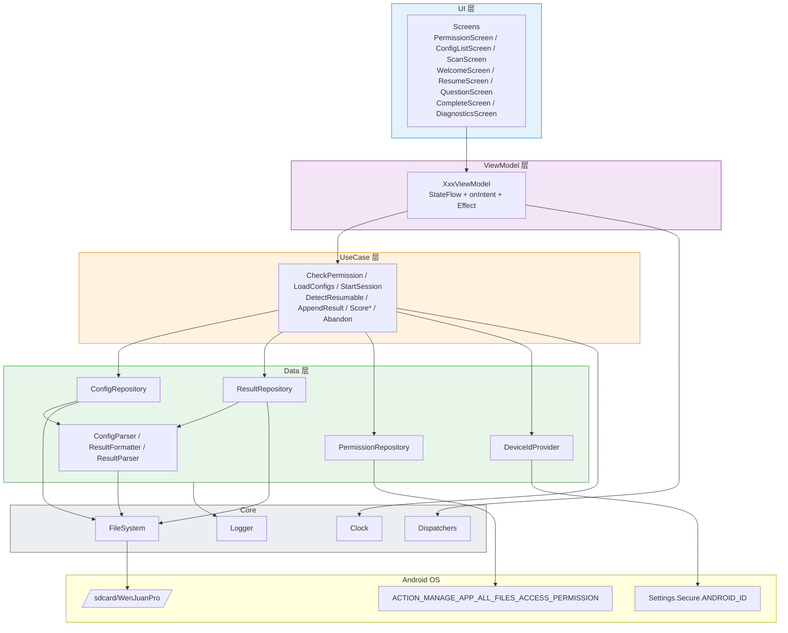

# 组件

App 按分层职责划分为以下逻辑组件；括号内为 Kotlin package。

## UI 层

**职责:** Compose Composable 与 Navigation 路由；不持有业务状态。

**关键接口:**

- `@Composable fun WenJuanProApp()`: 根 Composable，托管 NavHost + Theme
- `NavGraph`: 声明所有 Screen 之间的路由与参数传递

**依赖:** `ViewModel` 层（通过 `hiltViewModel()` 注入）

**技术栈:** Compose (BOM 2024.09.02) + Navigation-Compose 2.8.0 + Material 3

**Package:** `ai.wenjuanpro.app.ui.{theme, components, screens.{permission, configlist, scan, welcome, resume, question, complete, diagnostics}}`

## ViewModel 层

**职责:** 持有 `StateFlow<UiState>`；接收 UI 发出的 `Intent`；调用 UseCase；产生 `Effect`（一次性导航 / Toast / 震动）。

**关键接口:**

- `PermissionViewModel` / `ConfigListViewModel` / `ScanViewModel` / `WelcomeViewModel` / `ResumeViewModel` / `QuestionViewModel` / `CompleteViewModel` / `DiagnosticsViewModel`
- 每个 VM 暴露 `uiState: StateFlow<UiState>`, `onIntent(intent: Intent)`, `effects: Flow<Effect>`

**依赖:** UseCase 层

**技术栈:** Kotlin Coroutines 1.8.1 + Hilt 2.52

**Package:** `ai.wenjuanpro.app.feature.{domain}.vm`

## UseCase 层

**职责:** 单一业务用例的组合逻辑；无状态，可多次调用；不感知 Android Framework（除必要的 `Settings.Secure`）。

**主要 UseCase:**

- `CheckPermissionUseCase`
- `LoadConfigsUseCase` — 触发 `ConfigRepository.loadAll()`；聚合有效/损坏结果
- `StartSessionUseCase` — 生成 `Session`，创建 result 文件并写 header
- `DetectResumableSessionUseCase` — 扫描 `results/` 匹配当前 `studentId + configId`
- `AppendResultUseCase` — 将 `ResultRecord` 原子追加入当前 session 文件
- `ScoreSingleChoiceUseCase` / `ScoreMultiChoiceUseCase` / `ScoreMemoryUseCase`
- `AbandonSessionUseCase` — 放弃续答时重命名旧文件为 `.abandoned.{ts}`

**依赖:** Repository 层

**Package:** `ai.wenjuanpro.app.domain.usecase`

## Data / Repository 层

**职责:** 文件系统与 Android 系统 API 的唯一访问入口。

**关键组件:**

- `ConfigRepository`
  - `suspend fun loadAll(): List<ConfigLoadResult>`（IO Dispatcher）
  - `ConfigLoadResult` = `Valid(Config)` | `Invalid(fileName, errors: List<ParseError>)`
- `ResultRepository`
  - `suspend fun openSession(session: Session)`（写 header）
  - `suspend fun append(record: ResultRecord)`（整行 build → write → flush → fsync）
  - `suspend fun findResumable(studentId: String, configId: String): ResumeCandidate?`
  - `suspend fun abandon(fileName: String)`
- `PermissionRepository`
  - `fun isExternalStorageManager(): Boolean`
  - `fun buildManageStorageIntent(): Intent?`
- `DeviceIdProvider`
  - `fun getSsaid(): String`（失败抛 `SsaidUnavailableException`）

**依赖:** `ConfigParser` / `ResultFormatter` / `FileSystem`

**Package:** `ai.wenjuanpro.app.data.{config, result, permission, device}`

## Parser / Formatter

**职责:** TXT 与内存数据结构的双向转换；纯 Kotlin，可在 JVM 单测运行。

**关键组件:**

- `ConfigParser`
  - `fun parse(sourceName: String, text: String): ParseResult`
  - `ParseResult` = `Success(Config)` | `Failure(errors: List<ParseError>)`
  - `ParseError(line: Int, field: String?, code: ParseErrorCode, message: String)`
- `ResultFormatter`
  - `fun formatHeader(session: Session): String`
  - `fun formatRecord(record: ResultRecord): String`
- `ResultParser`（仅续答场景使用）
  - `fun parseCompletedQids(text: String): Set<String>`

**依赖:** 无（纯 Kotlin stdlib）

**Package:** `ai.wenjuanpro.app.data.parser`

## Core / Infrastructure

**职责:** 分层之间共享的基础设施。

**关键组件:**

- `FileSystem`（对 `java.io.File` / `Okio` 的薄封装）—— 便于测试用假实现
- `Dispatchers`（`@IoDispatcher` / `@MainDispatcher` 注解 + Hilt 模块）
- `Clock`（`fun nowMs(): Long`；可替换为测试时钟）
- `Logger`（Timber 封装）

**Package:** `ai.wenjuanpro.app.core.{io, concurrency, time, log}`

## 组件图

---
