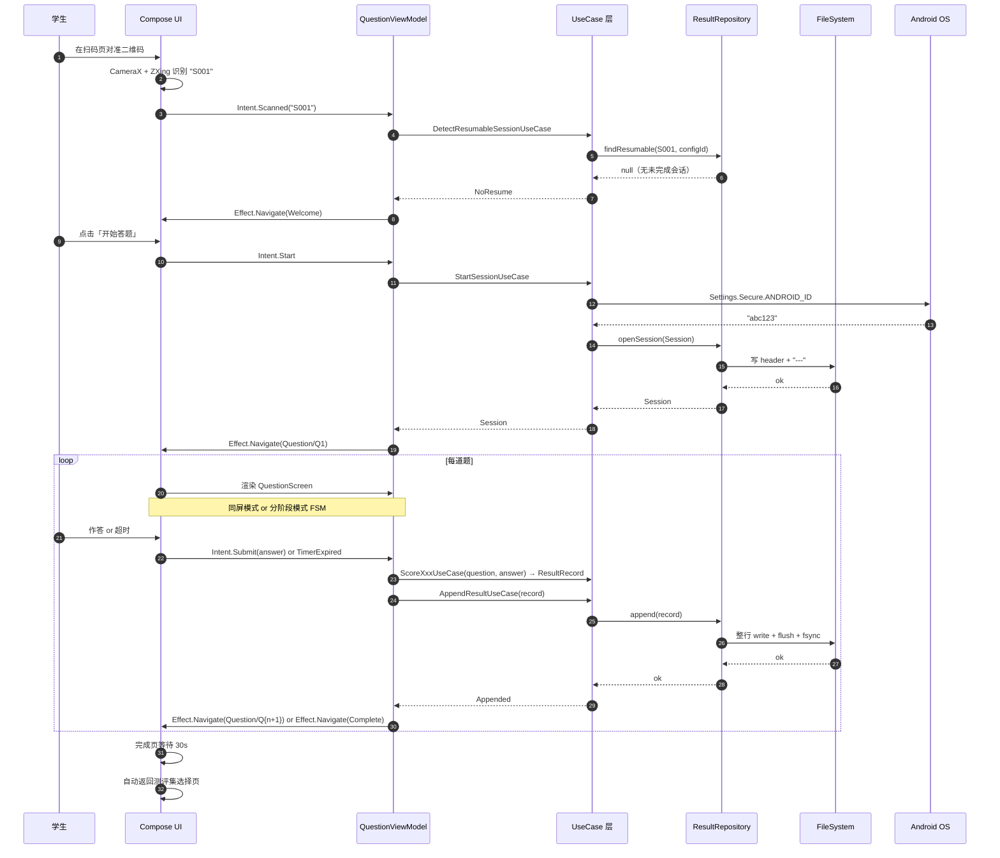
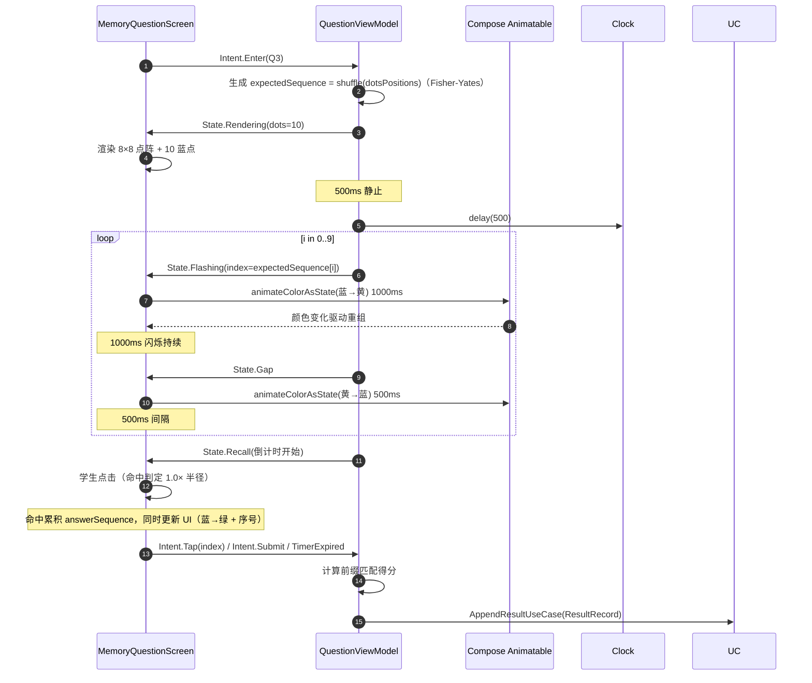
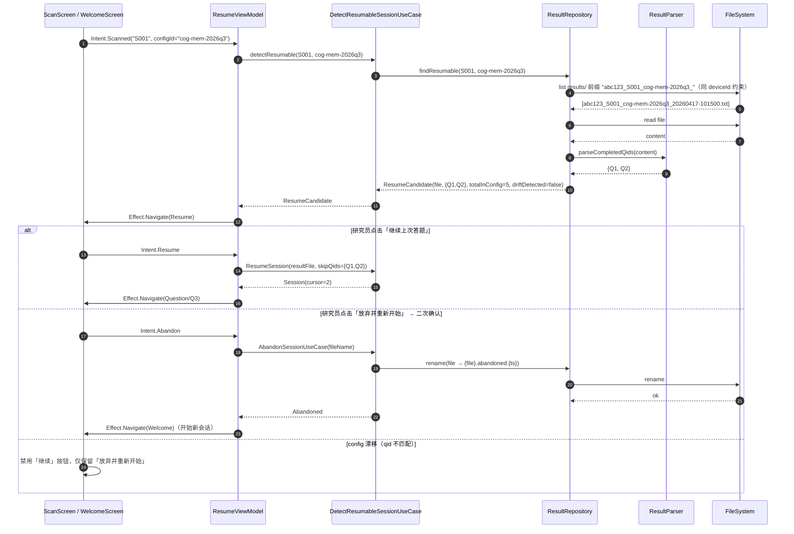
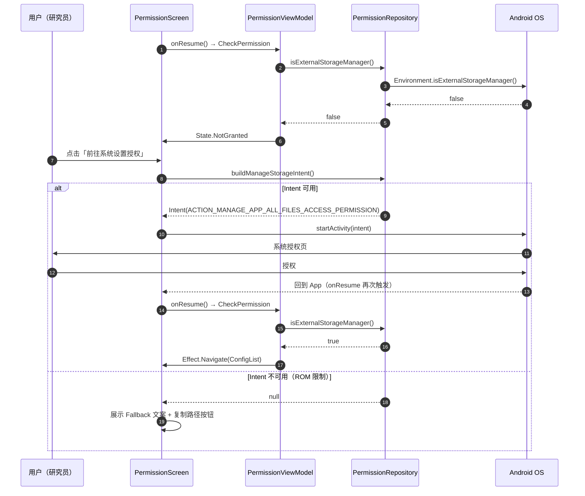

# 核心工作流

## 工作流 1: 学生完成一次测评（新会话，含记忆题）

```mermaid
sequenceDiagram
    autonumber
    participant U as 学生
    participant UI as Compose UI
    participant VM as QuestionViewModel
    participant UC as UseCase 层
    participant Repo as ResultRepository
    participant FS as FileSystem
    participant OS as Android OS

    U->>UI: 在扫码页对准二维码
    UI->>UI: CameraX + ZXing 识别 "S001"
    UI->>VM: Intent.Scanned("S001")
    VM->>UC: DetectResumableSessionUseCase
    UC->>Repo: findResumable(S001, configId)
    Repo-->>UC: null（无未完成会话）
    UC-->>VM: NoResume
    VM->>UI: Effect.Navigate(Welcome)
    U->>UI: 点击「开始答题」
    UI->>VM: Intent.Start
    VM->>UC: StartSessionUseCase
    UC->>OS: Settings.Secure.ANDROID_ID
    OS-->>UC: "abc123"
    UC->>Repo: openSession(Session)
    Repo->>FS: 写 header + "---"
    FS-->>Repo: ok
    Repo-->>UC: Session
    UC-->>VM: Session
    VM->>UI: Effect.Navigate(Question/Q1)

    loop 每道题
        UI->>VM: 渲染 QuestionScreen
        Note over UI,VM: 同屏模式 or 分阶段模式 FSM
        U->>UI: 作答 or 超时
        UI->>VM: Intent.Submit(answer) or TimerExpired
        VM->>UC: ScoreXxxUseCase(question, answer) → ResultRecord
        VM->>UC: AppendResultUseCase(record)
        UC->>Repo: append(record)
        Repo->>FS: 整行 write + flush + fsync
        FS-->>Repo: ok
        Repo-->>UC: ok
        UC-->>VM: Appended
        VM->>UI: Effect.Navigate(Question/Q{n+1}) or Effect.Navigate(Complete)
    end

    UI->>UI: 完成页等待 30s
    UI->>UI: 自动返回测评集选择页
```

## 工作流 2: 记忆题闪烁序列（时序关键）

```mermaid
sequenceDiagram
    autonumber
    participant UI as MemoryQuestionScreen
    participant VM as QuestionViewModel
    participant Anim as Compose Animatable
    participant Clock as Clock

    UI->>VM: Intent.Enter(Q3)
    VM->>VM: 生成 expectedSequence = shuffle(dotsPositions)（Fisher-Yates）
    VM->>UI: State.Rendering(dots=10)
    UI->>UI: 渲染 8×8 点阵 + 10 蓝点

    Note over VM: 500ms 静止
    VM->>Clock: delay(500)

    loop i in 0..9
        VM->>UI: State.Flashing(index=expectedSequence[i])
        UI->>Anim: animateColorAsState(蓝→黄) 1000ms
        Anim-->>UI: 颜色变化驱动重组
        Note over UI: 1000ms 闪烁持续
        VM->>UI: State.Gap
        UI->>Anim: animateColorAsState(黄→蓝) 500ms
        Note over UI: 500ms 间隔
    end

    VM->>UI: State.Recall(倒计时开始)
    UI->>UI: 学生点击（命中判定 1.0× 半径）
    Note over UI: 命中累积 answerSequence，同时更新 UI（蓝→绿 + 序号）
    UI->>VM: Intent.Tap(index) / Intent.Submit / TimerExpired
    VM->>VM: 计算前缀匹配得分
    VM->>UC: AppendResultUseCase(ResultRecord)
```

## 工作流 3: 断点续答

```mermaid
sequenceDiagram
    autonumber
    participant UI as ScanScreen / WelcomeScreen
    participant VM as ResumeViewModel
    participant UC as DetectResumableSessionUseCase
    participant Repo as ResultRepository
    participant Parser as ResultParser
    participant FS as FileSystem

    UI->>VM: Intent.Scanned("S001", configId="cog-mem-2026q3")
    VM->>UC: detectResumable(S001, cog-mem-2026q3)
    UC->>Repo: findResumable(S001, cog-mem-2026q3)
    Repo->>FS: list results/ 前缀 "abc123_S001_cog-mem-2026q3_"（同 deviceId 约束）
    FS-->>Repo: [abc123_S001_cog-mem-2026q3_20260417-101500.txt]
    Repo->>FS: read file
    FS-->>Repo: content
    Repo->>Parser: parseCompletedQids(content)
    Parser-->>Repo: {Q1, Q2}
    Repo-->>UC: ResumeCandidate(file, {Q1,Q2}, totalInConfig=5, driftDetected=false)
    UC-->>VM: ResumeCandidate
    VM->>UI: Effect.Navigate(Resume)

    alt 研究员点击「继续上次答题」
        UI->>VM: Intent.Resume
        VM->>UC: ResumeSession(resultFile, skipQids={Q1,Q2})
        UC-->>VM: Session(cursor=2)
        VM->>UI: Effect.Navigate(Question/Q3)
    else 研究员点击「放弃并重新开始」 → 二次确认
        UI->>VM: Intent.Abandon
        VM->>UC: AbandonSessionUseCase(fileName)
        UC->>Repo: rename(file → {file}.abandoned.{ts})
        Repo->>FS: rename
        FS-->>Repo: ok
        UC-->>VM: Abandoned
        VM->>UI: Effect.Navigate(Welcome)（开始新会话）
    else config 漂移（qid 不匹配）
        UI->>UI: 禁用「继续」按钮，仅保留「放弃并重新开始」
    end
```

## 工作流 4: MANAGE_EXTERNAL_STORAGE 授权

```mermaid
sequenceDiagram
    autonumber
    participant U as 用户（研究员）
    participant UI as PermissionScreen
    participant VM as PermissionViewModel
    participant Repo as PermissionRepository
    participant OS as Android OS

    UI->>VM: onResume() → CheckPermission
    VM->>Repo: isExternalStorageManager()
    Repo->>OS: Environment.isExternalStorageManager()
    OS-->>Repo: false
    Repo-->>VM: false
    VM->>UI: State.NotGranted
    U->>UI: 点击「前往系统设置授权」
    UI->>Repo: buildManageStorageIntent()
    alt Intent 可用
        Repo-->>UI: Intent(ACTION_MANAGE_APP_ALL_FILES_ACCESS_PERMISSION)
        UI->>OS: startActivity(intent)
        OS->>U: 系统授权页
        U->>OS: 授权
        OS-->>UI: 回到 App（onResume 再次触发）
        UI->>VM: onResume() → CheckPermission
        VM->>Repo: isExternalStorageManager()
        Repo-->>VM: true
        VM->>UI: Effect.Navigate(ConfigList)
    else Intent 不可用（ROM 限制）
        Repo-->>UI: null
        UI->>UI: 展示 Fallback 文案 + 复制路径按钮
    end
```

---
