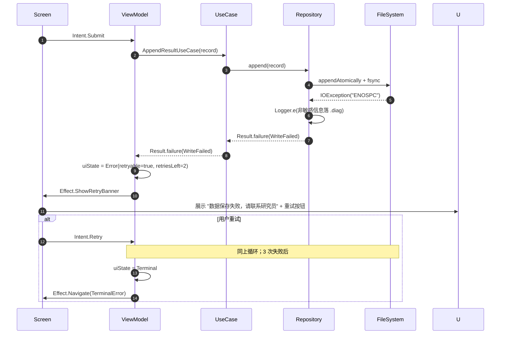

# 错误处理策略

## 错误流程



## 错误响应格式

由于无网络 API，"错误响应格式"在本项目对应 UI 层错误模型：

```kotlin
data class AppError(
    val code: String,           // UPPER_SNAKE_CASE（见 PRD error_handling）
    val messageRes: Int,        // strings.xml 资源 ID，不持中文字面量
    val retryable: Boolean,
    val recoveryAction: Recovery, // Retry / GoToSettings / GoBack / Copy / None
    val timestamp: Long,
    val requestId: String,      // 本地生成 UUID，仅用于诊断日志关联
)
```

## 前端错误处理

```kotlin
@Composable
fun ErrorBanner(error: AppError, onAction: (Recovery) -> Unit) {
    Card(/* ... */) {
        Row {
            Icon(Icons.Warning, contentDescription = null, tint = MaterialTheme.colorScheme.error)
            Text(stringResource(error.messageRes))
            Spacer(Modifier.weight(1f))
            when (error.recoveryAction) {
                Recovery.Retry -> Button(onClick = { onAction(Recovery.Retry) }) { Text("重试") }
                Recovery.GoToSettings -> Button(onClick = { onAction(Recovery.GoToSettings) }) { Text("前往系统设置") }
                Recovery.Copy -> Button(onClick = { onAction(Recovery.Copy) }) { Text("复制") }
                else -> {}
            }
        }
    }
}
```

## 后端错误处理（= Repository / UseCase 异常转换）

```kotlin
// Repository 层：IOException → 业务 Result.failure
class ResultRepositoryImpl {
    override suspend fun append(record: ResultRecord): Result<Unit> = runCatching {
        withContext(ioDispatcher) {
            try {
                fileSystem.appendAtomically(path, line)
                fileSystem.fsync(path)
            } catch (e: IOException) {
                Timber.tag("result").e(e, "append failed: qid=${record.qid}")
                throw WriteFailedException(cause = e)
            }
        }
    }
}

// UseCase 层：统一包装为 AppError
class AppendResultUseCase @Inject constructor(private val repo: ResultRepository) {
    suspend operator fun invoke(record: ResultRecord): Result<Unit> =
        repo.append(record).recoverCatching { cause ->
            when (cause) {
                is WriteFailedException -> throw AppFailure(
                    code = "RESULT_WRITE_FAILED",
                    messageRes = R.string.err_result_write_failed,
                    retryable = true,
                    recoveryAction = Recovery.Retry,
                )
                else -> throw cause
            }
        }
}
```

**错误恢复优先级（与 PRD / UX 对齐）:**

1. **用户可自愈**（授权、磁盘空间、config 格式）→ 展示明确指引 + 跳系统设置/重试按钮
2. **研究员干预**（数据保存失败、SSAID 不可读）→ 展示"请联系研究员"并允许重试（≤ 3 次）
3. **不可恢复**（三次重试仍失败 / config 彻底损坏）→ 终止页，引导返回首屏；相应 `.diag` 日志写入完整 stacktrace

---
