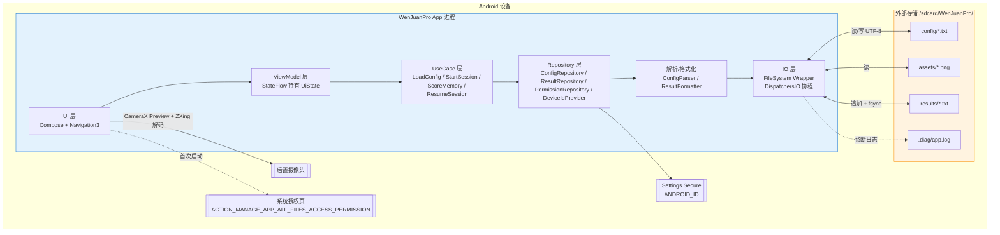

# 高层架构

## 技术概述

WenJuanPro 采用 **单体 Android 原生架构 + MVI 单向数据流**，基于 Kotlin + Jetpack Compose（Material 3）+ Compose Animation 构建；所有持久化经由固定路径 `/sdcard/WenJuanPro/{config,assets,results,.diag}/` 下的 TXT / 图片文件完成，**无数据库、无后端、无网络**。UI 层（Composables + Navigation）通过 `ViewModel` 持有 `StateFlow<UiState>`，向业务逻辑层（`UseCase`）发 `Intent` 并接收 `Effect`；业务逻辑层依赖两个核心 Repository（`ConfigRepository` / `ResultRepository`）完成文件系统读写；动画与时序完全依赖 Compose 高层 API（`Animatable`、`animate*AsState`、`InfiniteTransition`），不使用 `Choreographer` 或 `withFrameNanos`。该架构以"最少活动部件 + 单一事实源（TXT）+ 严格分层"直接对齐 PRD 的 ±50ms 时序抖动、≥ 99.5% 数据完整率、100% 断点恢复三大核心 NFR。

## 平台与基础设施选择

**平台:** Android OS（API 26 至 API 34）  
**核心服务:** 仅 Android 系统 API（`Settings.Secure.ANDROID_ID` / `CameraX`（仅预览） / `MANAGE_EXTERNAL_STORAGE` / `Environment.getExternalStorageDirectory()`）；无云服务、无 Google Play Services  
**部署主机与区域:** N/A —— APK 通过 U 盘 / 微信 / 内部分发链接手动侧载；不上架任何应用市场  
**数据主权:** 全程驻留于本地外部存储；App 不发起任何网络请求（编译期依赖白名单守门）

## 仓库结构

**结构:** 单仓（Monorepo = No, Polyrepo = No；即单一 Git 仓库 `WenJuanPro/`）  
**Monorepo 工具:** N/A  
**包组织方式:** 初期单 Gradle 模块 `app/`，按 Kotlin package 按职责分层（`ui` / `feature` / `domain` / `data` / `core`）；第二阶段按认知范式题型拆 feature module（`feature-memory`、`feature-nback` 等）

## 高层架构图

## 架构模式

- **MVI（Model-View-Intent）单向数据流:** UI → Intent → Reducer → State → UI。_理由:_ Compose 声明式范式天然契合不可变状态；单向流降低作答流程（倒计时 × 异步 IO × 动画）的状态错乱风险。
- **分层架构（UI / Domain / Data）:** UI 层仅依赖 ViewModel；ViewModel 仅依赖 UseCase；UseCase 仅依赖 Repository 接口。_理由:_ 文件 IO 可替换为假实现以支持单元测试；解析器与格式化器可脱离 Android runtime 在 JVM 上测试。
- **Repository 模式:** `ConfigRepository` / `ResultRepository` / `PermissionRepository` 抽象所有外部存储与系统 API 访问。_理由:_ 屏蔽 TXT 格式与文件系统 API 的演进；为断点续答、诊断工具等横切功能提供统一入口。
- **单一事实源（Single Source of Truth = TXT 文件）:** 不引入 Room / SQLite，避免"内存状态 / DB / 文件"三态双写。_理由:_ 研究员诉求是"TXT 双向可读写"；任何本地 DB 都会制造同步复杂度与调试盲点。
- **有限状态机（FSM）驱动作答流程:** 题目级与会话级两层 FSM；题目级状态（Staged 模式下的 Stem / Options 阶段）由 ViewModel 持有，会话级状态（授权 / 选题 / 扫码 / 续答 / 作答 / 完成）由 Navigation 持有。_理由:_ 使"题干超时自动进入选项阶段"、"半完成题整题重做"等规则可以用表驱动方式显式建模并单测覆盖。
- **原子追加写入（Atomic Append）:** 每行结果在内存组装完整后一次性 `write + flush + fsync`，不分段落笔。_理由:_ 满足 NFR12「强杀不出现半行」；避免续答时解析到半行导致误判。
- **依赖注入（Hilt）:** Repository / UseCase / ViewModel 由 Hilt 图注入。_理由:_ 便于测试替身；保持 ViewModel 构造函数显式依赖。
- **Immutable Config Snapshot:** Config 解析完成后以 `data class` 冻结；整个测评会话引用同一实例，避免 config 文件在作答期间被改动造成 FSM 漂移。

---
