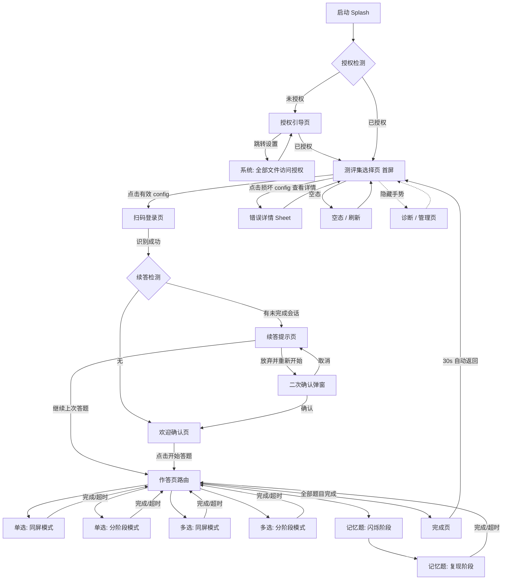
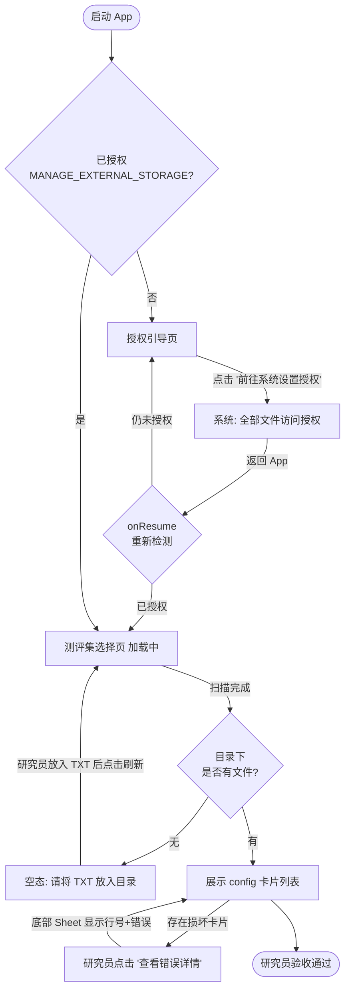
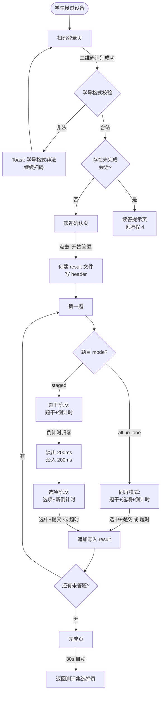
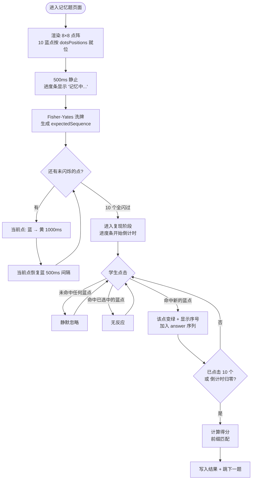
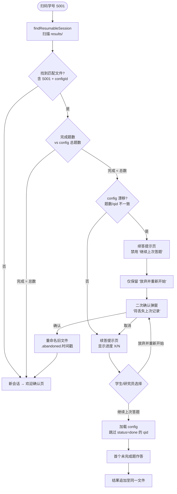
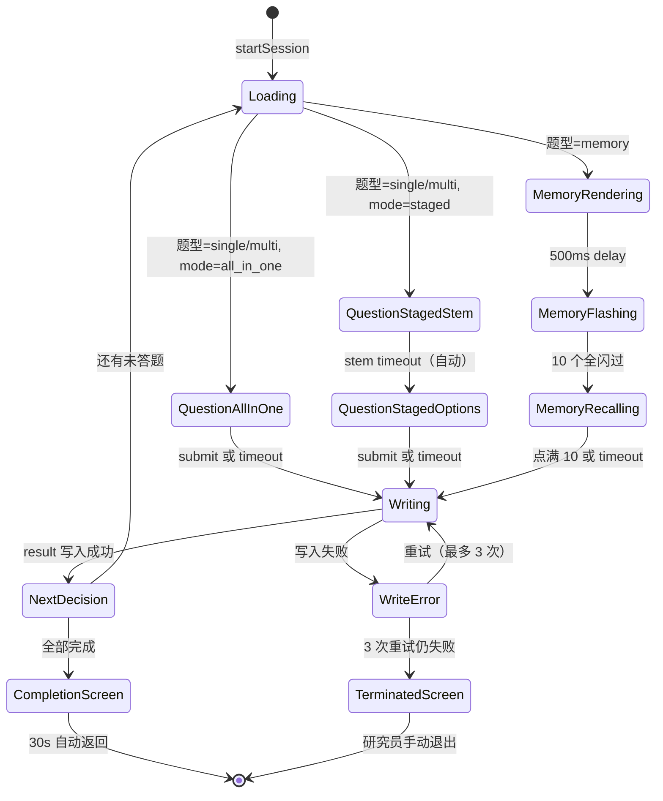

# WenJuanPro UI/UX 规格说明书

> 版本: v1.0 · 日期: 2026-04-17 · 作者: 计成（UX 专家） · 模式: draft-first
>
> 输入: `docs/project-brief.md` v0.2 + `docs/prd.md` v1.0（2026-04-17）

---

## 引言

本文档定义了 **WenJuanPro**（Android 离线认知测评 App）用户界面的用户体验目标、信息架构、用户流程和视觉设计规格。它是视觉设计和前端开发（Jetpack Compose）的基础，确保提供一致且以**研究场景可控性**为核心的体验。

**本规格的特殊约束**：

- **研究级视觉时序优先**：所有视觉元素以"不干扰认知测评数据"为第一原则；任何"锦上添花"的动效、品牌视觉、反馈声音一律剔除。
- **双人设、双心智模型**：研究员（启动前配置）与学生（作答中）在不同阶段接管同一台设备；UX 须在同一 App 内服务两种截然不同的使用动机。
- **零文本输入、单向流转**：作答流程中不出现键盘，不提供"上一题"返回路径。

### 总体 UX 目标与原则

#### 目标用户画像

- **专业用户 / 研究员（配题者）**：高校心理学/认知科学/教育学实验室的硕博生与科研教师；具备 Excel/R/Python 基础，**不一定会写代码**。关心"TXT 能否被正确加载"、"结果文件能否被完整回收"、"时序是否达标"。偶发性使用（每轮测评现场 1-2 次），单次停留 ≤ 5 分钟。
- **普通用户 / 学生（被试）**：K12 至大学阶段学生；单次参与时长 5-15 分钟；**扫码即进入、扫码即离开**。对登录/注册流程敏感，易流失；对认知类任务需要清晰的视觉引导与无干扰背景。
- **（隐藏）管理员 / 研究员（诊断模式）**：通过隐藏入口进入诊断页；在现场出故障时快速定位问题（授权、SSAID、最近会话）。

#### 可用性目标

- **研究员首次上手（冷启动可用性）**：研究员从安装 APK 到看到自己的 config 出现在测评集选择页，**≤ 2 分钟**（含授权跳转）。
- **学生使用效率**：扫码到开始答题 **≤ 3 秒**（摄像头启动 + 扫码识别 + 欢迎页确认合计）。
- **防错设计**：损坏 config 置灰、不可选中；命中算法 1.0× 半径刻意"宁偏勿滥"；学生无手输学号入口（杜绝数据污染）。
- **可记忆性**：研究员下一轮现场（2 周后）无需重学；全部流程靠页面自身提示即可走通。
- **作答流失率 < 5%**：学生在测评期间因 UI 误导或流程中断退出的比例。

#### 设计原则

1. **研究精确性优于美学 / Precision Over Aesthetics** — 任何视觉选择先过滤"是否影响测评数据"这一问；命中半径 1.0×、配色固定、无暗色模式。
2. **单向流转 / One-Way Only** — 作答页不提供"上一题"、无"重来"；只有"提交并下一题"或"超时自动下一题"两条路径。
3. **倒计时即唯一反馈 / Timer Is The Only Feedback** — 顶部进度条是学生在作答页的主要注意锚点；不叠加音效、不弹窗、不显示剩余秒数文本（避免学生"卡表"）。
4. **错误即引导 / Errors Are Instructions** — 所有错误文案必须给出"下一步该做什么"，而非纯错误码；研究员是错误消费的第一责任人，学生侧错误收敛到"请联系研究员"。
5. **学生侧零认知负担 / Zero Overhead For Test-Takers** — 学生无需学习任何 App 概念；扫码、点击、等待，仅此三种动作。
6. **研究员侧文本至上 / Text-First For Researchers** — 配置即 TXT；错误即行号；结果即 TXT；永不引入 GUI 配题工具。

#### 变更日志

| 日期       | 版本 | 描述                                               | 作者 |
|------------|------|----------------------------------------------------|------|
| 2026-04-17 | v0.1 | 初稿，基于 project-brief v0.2 + PRD v1.0           | 计成 |
| 2026-04-17 | v1.0 | 定稿；用户确认全部 7 项 Phase 3 决策（隐藏入口长按 5s / 题干 22sp / 预警橙 #FB8C00 / 点阵 0.9 屏宽 / 分阶段切换 200+200ms 串行 / 不用 Figma / 隐藏入口定位右上角刷新按钮右侧空白） | 计成 |

---

## 信息架构 (IA)

### 站点地图 / 页面清单



### 导航结构

**主导航:** 无持久主导航栏（Tab/Drawer 不存在）。App 为**线性向导式**（Wizard），每一页只有一个或两个前进动作；返回动作由各页面按需决定（详见下文"返回键策略"）。

**次级导航:** 无次级导航。偶尔出现的 Bottom Sheet（错误详情、放弃确认）不算导航，均以 Sheet 形式呈现并可关闭。

**面包屑策略:** 不使用面包屑。学生注意力须集中在当前题；研究员流程为一次性线性流转，面包屑价值低。

**返回键策略（物理返回键 / System Back）**：

| 页面                                  | 返回键行为                              | 理由                                   |
|---------------------------------------|----------------------------------------|----------------------------------------|
| 授权引导页                            | 退出 App                                | 无前驱页面                             |
| 测评集选择页                          | 退出 App                                | 首屏                                   |
| 扫码登录页                            | 返回测评集选择页                        | 研究员可切换 config                    |
| 欢迎确认页                            | 返回扫码登录页（重新扫码）              | 允许研究员换学生                       |
| 续答提示页                            | 返回扫码登录页                          | 同上                                   |
| 作答页（所有题型、所有模式）          | **消费返回键**（无效）                  | 作答期间严禁退出                       |
| 完成页                                | **消费返回键**（无效）                  | 强制 30s 自动返回                      |
| 诊断 / 管理页                         | 返回测评集选择页                        | 研究员诊断后即可继续                   |

**隐藏入口（管理出口）:**

- **触发方式（MVP 占位）**：在测评集选择页"右上角空白区域长按 5 秒"触发。具体手势与视觉反馈由 Architect 在技术实现细节中细化（参见 PRD 技术假设注记），但必须满足：
  1. 学生随机点击无法触发（需持续按压 ≥ 5 秒 + 位置精确 + 单指）；
  2. 触发过程无任何视觉反馈（避免学生偶然发现）；
  3. 触发后直接进入诊断页，**不弹出密码确认**（现场研究员即是管理员，简化操作）。

---

## 用户流程

### 流程 1: 研究员首次部署（冷启动）

**用户目标:** 研究员拿到 APK 后，首次在一台 Android 设备上完成安装 → 授权 → 验证 TXT 配置能被正确识别。

**入口点:** 研究员通过 U 盘/微信/内部链接获得 APK，手动安装并首次打开。

**成功标准:** 测评集选择页能正确列出研究员预置的所有 config，且区分有效/损坏；从启动 App 到看到可用 config **≤ 2 分钟**（含系统授权页跳转）。

#### 流程图



#### 边界情况与错误处理:

- **用户拒绝授权或返回时仍未授权**：保持在授权引导页，按钮文案变为"再次前往系统设置"；无指责性文案。
- **设备 ROM 不支持 `ACTION_MANAGE_APP_ALL_FILES_ACCESS_PERMISSION` Intent**：授权引导页切换为纯文本指引"请手动前往：设置 → 应用 → WenJuanPro → 权限 → 全部文件访问"，并提供"复制路径"按钮便于研究员照着点。
- **config 目录不存在**：自动 `mkdirs()` 并展示空态文案。
- **扫描超时（5s）**：停止扫描；展示"扫描题库超时，请检查目录"错误 + 重试按钮（研究员侧可自诊断）。
- **全部 config 损坏**：不触发空态；展示全部损坏卡片（置灰）+ 顶部横幅"当前无可用测评集"。

**备注:** 研究员的首次成功是 App 的**第一个信任时刻**；错误文案必须具体到"行号 + 字段 + 原因"三要素，而不是"解析失败"一句话。

---

### 流程 2: 学生完整作答（新会话，无记忆题）

**用户目标:** 学生扫码 → 完成一份包含单选与多选题的测评 → 设备交还研究员。

**入口点:** 研究员已在测评集选择页选定有效 config，将设备递给学生；学生看到扫码页。

**成功标准:** 学生在不被引导的情况下独立完成全流程；全程耗时 = 扫码（<3s）+ 所有题目倒计时之和 + 完成页确认（即时返回）。

#### 流程图



#### 边界情况与错误处理:

- **扫码到非法学号**：底部 Toast 2 秒，摄像头不停止，继续等待下一次扫码。
- **CAMERA 权限被拒**：扫码页变为错误态，展示"重新申请权限" + "前往系统设置"双按钮。
- **结果写入失败（磁盘满 / 权限丢失）**：阻塞下一题跳转，展示"数据保存失败，请联系研究员" + 重试按钮；重试 3 次仍失败跳转终止页。
- **题干阶段超时自动进入选项阶段**：这是**正常流转**，非错误；学生侧无感知（仅看到题干淡出、选项淡入）。
- **题干阶段学生点击屏幕**：静默忽略，无任何反馈（避免训练学生"摸出"交互模式）。
- **倒计时 ≤ 5 秒**：进度条颜色 Primary 蓝 → 橙色（`#FB8C00`），无音效，无震动。

**备注:** 学生全流程不出现"对/错"反馈（多选题正确答案仅写入结果文件，不展示给学生）；完成页不展示得分。

---

### 流程 3: 记忆闪烁点击题作答

**用户目标:** 学生观察 10 个蓝点按随机顺序闪烁一遍，然后按记忆顺序点击复现。

**入口点:** 作答控制器推进到一道 `type=memory` 的题目。

**成功标准:** 闪烁时序抖动 ≤ ±50ms（NFR2）；学生在复现阶段的点击被准确记录（命中半径 1.0×）；点击序列、期望序列、命中数、复现用时均写入结果文件。

#### 流程图



#### 边界情况与错误处理:

- **闪烁阶段学生任何点击**：全屏禁用点击判定；不记录、不反馈、不影响序列。
- **未命中点击（触点距离最近蓝点 > 1.0× 半径）**：静默忽略，不 toast、不震动。
- **已点击的蓝点再次被点**：无反应（不视为错误，学生可能手抖）。
- **倒计时归零未点满 10 个**：已点击部分按前缀匹配计分；`status=done`（学生有作答动作）。
- **完全未点击超时**：`answer=''`, `score=0`, `status=not_answered`。
- **Compose 动画 API 在极端低端机型抛异常**：记录 `.diag` 日志；本题 `status=error`；**对学生不可见**；自动跳下一题。
- **`dotsPositions` 在运行时异常（理论上已在 Story 1.3 schema 校验拦截）**：终止当前题，写入 `status=error`。

**备注:** 记忆题的**沉默反馈**是有意设计——若命中/未命中给出即时反馈，学生会基于反馈调整策略（如"试探性轻点"），破坏测评对"纯视觉短时记忆"的测量。**颜色变化（蓝→黄→蓝→绿）是唯一的反馈通道**。

---

### 流程 4: 断点续答

**用户目标:** 学生中途被打断（老师叫、设备没电、App 异常退出）后再次扫码同一学号，从中断点继续作答。

**入口点:** 学生再次扫码；App 在欢迎确认页前检测到同学号 + 同 configId 的未完成 result 文件。

**成功标准:** 续答位置恢复准确率 100%；续答命中率 ≥ 95%（NFR）。

#### 流程图



#### 边界情况与错误处理:

- **结果文件损坏（半行、编码错误）**：重命名为 `{原名}.corrupt.{时间戳}`，按新会话处理，**对学生不提示**（避免困扰），仅研究员可在诊断页看到。
- **config 漂移（题数/qid 变更）**：续答提示页禁用"继续上次答题"按钮，**保留**"放弃并重新开始"；二次确认文案增加"（题库已发生变化）"红字注释。
- **旧文件重命名失败（磁盘权限问题）**：阻塞，弹窗"无法重命名旧记录，请联系研究员"，不允许继续。
- **`status=not_answered` / `status=error` 的题目**：视为未完成，重做（不跳过）。
- **staged 模式半完成题（理论上不应发生）**：按整题重做（两阶段倒计时全部重新开始）。

**备注:** 续答提示页是整个 App 唯一一个**二人决策点**——通常由研究员替学生做选择（学生自己可能分不清"继续"与"放弃"的后果）。因此主按钮选择"继续上次答题"作为安全默认，"放弃"按钮置于次要位置 + 二次确认。

---

## 线框图与原型

**主设计文件:** _MVP 阶段不使用 Figma/Sketch 等设计工具_；所有关键页面采用**文本线框（ASCII + 组件规格表）**直接在本规格中呈现，由前端工程师（Architect 指导下）直接基于 Compose 实现。**理由**：① MVP 视觉极简（仅 Material 3 默认 + 3 个自定义配色），无品牌/插画/动效工艺投入；② 研究员/开发者团队人员重合度高，减少交付路径；③ 视觉时序精度（±50ms）在设计工具中无法验证，必须以代码实现为准。

### 关键页面布局

#### 页面 1: 授权引导页

**用途:** 在未获得 `MANAGE_EXTERNAL_STORAGE` 权限时阻塞进入作答流程；引导研究员跳转系统设置完成授权。

**关键元素:**

- 居中图标区：`Icon.Folder`（或 `Icon.Warning`），尺寸 64dp，颜色 Primary 蓝
- 标题：`需要『全部文件访问』权限`
- 说明文案：`WenJuanPro 需要读取 /sdcard/WenJuanPro/config/ 下的题库 TXT 并将答题结果写入 /sdcard/WenJuanPro/results/。`
- 主按钮：`前往系统设置授权`（Primary 蓝，全宽，底部 24dp 边距）
- 次要按钮：`已完成授权，重新检测`（文字按钮，灰）
- Fallback 文案（当 Intent 不可用时显示）：`路径: 设置 → 应用 → WenJuanPro → 权限 → 全部文件访问` + 右侧 `复制` 小按钮

**交互说明:**

- 首次启动且未授权：无淡入动画，直接呈现。
- 点击主按钮：调用 `ACTION_MANAGE_APP_ALL_FILES_ACCESS_PERMISSION`；若 Intent 不可用则切换为 Fallback 文案 + 复制按钮。
- 返回 App（`onResume`）：自动重新检测；已授权则立即跳转测评集选择页。
- 被系统 ROM 拦截或授权失败：按钮文案变为`再次前往系统设置`；无错误弹窗。

**Compose 布局草图:**

```
Scaffold
├─ TopAppBar (标题: WenJuanPro, 无返回)
└─ Column(modifier = padding(24.dp), verticalArrangement = Center, horizontalAlignment = CenterHorizontally)
   ├─ Icon(Icons.Folder, size = 64.dp, tint = Primary)
   ├─ Spacer(32.dp)
   ├─ Text('需要『全部文件访问』权限', style = titleLarge)
   ├─ Spacer(16.dp)
   ├─ Text(说明文案, style = bodyMedium, textAlign = Center)
   ├─ Spacer(8.dp)
   ├─ [Fallback Text Row · 条件渲染]
   ├─ Spacer(48.dp)
   ├─ Button('前往系统设置授权', modifier = fillMaxWidth())
   ├─ Spacer(12.dp)
   └─ TextButton('已完成授权，重新检测')
```

---

#### 页面 2: 测评集选择页（首屏）

**用途:** 研究员验收 config 加载结果；学生作答前的启动入口；同时作为完成后 30s 自动返回的着陆页。

**关键元素:**

- 顶栏：`请选择测评集` + 右上角刷新按钮（`Icon.Refresh`）
- 主列表：config 卡片列表（垂直 LazyColumn）
  - 每张卡片：`configId`（等宽字体）、`title`（标题字号）、`题数徽标`（如 `5 题`）、`状态徽标`（`有效`/`损坏`）
  - 有效卡片：可点击，整卡 Ripple；圆角 8dp；卡片顶部左上角状态徽标 Primary 蓝底白字
  - 损坏卡片：整体置灰（alpha 0.5），不可点击；右下角 `查看错误详情` 文字按钮（可点）
- 空态：当目录无文件时，居中图标 + `请将 config TXT 文件放入 /sdcard/WenJuanPro/config/ 后点击刷新` + 次要按钮 `刷新`
- 底部 sheet（条件渲染）：错误详情 sheet，显示该文件所有错误行（`第 X 行: 字段 Y: 原因 Z`）
- **隐藏手势区**：右上角（刷新按钮右侧的空白）支持长按 5 秒进入诊断页（无视觉反馈）

**交互说明:**

- 进入页面：自动触发一次 `loadAll()`，加载指示器居中 `CircularProgressIndicator`；5 秒超时后展示重试按钮。
- 刷新按钮：重新扫描；按钮变灰（`enabled = false`）直到完成。
- 点击有效卡片：将 `configId` 存入 SessionState → 导航到扫码登录页。
- 点击损坏卡片的"查看错误详情"：弹出底部 Sheet，使用可滚动 `Column` 展示全部错误；sheet 关闭按钮在右上角。
- 整页无下拉刷新（`SwipeRefresh`）—— 避免学生误操作；只能通过右上角按钮刷新。

**Compose 布局草图:**

```
Scaffold
├─ TopAppBar(标题 '请选择测评集', actions = { IconButton(Refresh) })
└─ Box
   ├─ [LoadingIndicator · 条件]
   ├─ [EmptyState · 条件]
   ├─ [ErrorRetry · 条件]
   └─ LazyColumn(contentPadding = 16.dp, verticalSpacing = 12.dp)
       └─ items(configs) { config ->
            ConfigCard(
              configId = config.id,
              title = config.title,
              questionCount = config.questions.size,
              isValid = config.isValid,
              errors = config.errors,
              onClick = if (valid) navigateToScan else null,
              onViewErrors = { openBottomSheet(config.errors) }
            )
          }
```

---

#### 页面 3: 扫码登录页

**用途:** 通过后置摄像头扫描二维码获得学号，无手输入口。

**关键元素:**

- 全屏摄像头预览（`CameraX PreviewView` 外层包 Compose `AndroidView`）
- 半透明黑色遮罩（`#000000` 60% alpha），中央挖出一个**正方形取景框**（边长 = 屏宽 70%，圆角 16dp，边框 2dp 白色）
- 顶部提示文案：`请将二维码对准取景框`（白色，20sp，距顶部 64dp）
- 底部提示文案：`学号将自动从二维码获取`（白色，14sp，alpha 0.7，距底部 48dp）
- 左上角返回箭头（`Icon.ArrowBack`，白色，点击返回测评集选择页）
- **无任何键盘/手输入口**

**交互说明:**

- 进入页面：申请 `CAMERA` 运行时权限；首次拒绝则展示错误页。
- 识别成功（ML Kit / ZXing 回调）：
  1. 触觉反馈 50ms（`HapticFeedback.LongPress`）
  2. 摄像头立即停止（`preview.unbind()`）避免重复识别
  3. 执行学号格式校验（正则 `^[A-Za-z0-9_-]{1,64}$`）
  4. 合法：跳转下一页（欢迎确认 / 续答提示）
  5. 非法：底部显示 `Snackbar('学号格式非法')` 2 秒，摄像头继续工作
- CAMERA 权限被拒：页面切换为错误态，居中 `未获取摄像头权限，无法扫码登录` + `重新申请权限`（主）+ `前往系统设置`（次）
- 设备无后置摄像头：错误态 `未检测到摄像头` + `返回` 按钮

**Compose 布局草图:**

```
Box(fillMaxSize)
├─ AndroidView(CameraX PreviewView, fillMaxSize)
├─ ScanOverlay(取景框挖空 + 半透明遮罩)
├─ Column(align = TopCenter, padding = top 64.dp)
│   └─ Text('请将二维码对准取景框', color = White, 20.sp)
├─ Text(align = BottomCenter, padding = bottom 48.dp, alpha 0.7)
│   └─ '学号将自动从二维码获取'
└─ IconButton(align = TopStart, padding 16.dp, onClick = navigateBack)
    └─ Icon(ArrowBack, tint = White)
```

---

#### 页面 4: 欢迎确认页

**用途:** 展示扫码识别结果与测评信息，学生确认后正式进入作答。

**关键元素:**

- 顶栏：无标题（或空白）
- 中央内容区（垂直居中）：
  - 第一行：`欢迎，{学号}`（headlineMedium，Primary 蓝）
  - 分隔（24dp）
  - 第二行：测评标题（`title`，titleLarge，正文色）
  - 第三行：`{N} 题 · 预计 {M} 分钟`（bodyLarge，灰）
  - 第四行（可选）：`configId: {configId}`（等宽，10sp，alpha 0.5，调试信息便于研究员验证）
- 底部主按钮：`开始答题`（Primary 蓝，全宽，高度 56dp，底部 24dp 边距）

**交互说明:**

- 进入页面：无入场动画。
- 点击`开始答题`：
  1. 立即禁用按钮（防重复点击）
  2. 记录 `sessionStart` 时间戳
  3. 触发 `ResultRepository.startSession()` 创建结果文件并写入 header
  4. 500ms 内完成跳转到第一题
- 若 `ANDROID_ID` 读取失败：不进入作答；弹窗`无法读取设备 ID，请联系研究员` + 重试按钮。

**Compose 布局草图:**

```
Scaffold
└─ Column(fillMaxSize, padding 24.dp, verticalArrangement = SpaceBetween)
   ├─ Spacer(weight 1f)
   ├─ Column(horizontalAlignment = CenterHorizontally)
   │   ├─ Text('欢迎，$studentId', headlineMedium, color = Primary)
   │   ├─ Spacer(24.dp)
   │   ├─ Text(title, titleLarge, textAlign = Center)
   │   ├─ Spacer(8.dp)
   │   ├─ Text('$N 题 · 预计 $M 分钟', bodyLarge, color = OnSurfaceVariant)
   │   └─ Text('configId: $configId', 10.sp, alpha 0.5)
   ├─ Spacer(weight 1f)
   └─ Button('开始答题', fillMaxWidth, height 56.dp)
```

---

#### 页面 5: 续答提示页

**用途:** 检测到未完成会话时，让（通常是研究员）确认继续还是放弃。

**关键元素:**

- 顶部标题：`检测到未完成的测评`（headlineSmall，Primary 蓝）
- 信息区（`Card` 容器，16dp 内边距）：
  - `学号: {studentId}`
  - `测评: {configId} · {title}`
  - `进度: 已完成 {X} / {N} 题`
  - `上次开始: {sessionStart 格式化 yyyy-MM-dd HH:mm:ss}`
  - （config 漂移时）红色横幅：`⚠ 题库已发生变化，无法续答`
- 底部主按钮：`继续上次答题`（Primary 蓝，全宽；config 漂移时禁用置灰）
- 底部次按钮：`放弃并重新开始`（文字按钮，灰）
- 二次确认弹窗（条件渲染）：
  - 标题：`确认放弃？`
  - 内容：`将丢失上次记录（共 {X} 题作答），是否继续？`（config 漂移时加一句红字`（题库已发生变化）`）
  - 按钮：左`取消` 右`确认放弃`（Material Design 习惯：主要动作右侧）

**交互说明:**

- 进入页面：无入场动画。
- 点击`继续上次答题`：立即跳转到首个未完成题目。
- 点击`放弃并重新开始`：弹出二次确认 `AlertDialog`。
- 确认放弃：重命名旧文件 → 跳转欢迎确认页。
- 取消：关闭弹窗，保持在续答提示页。

---

#### 页面 6a: 作答页 · 同屏模式（all_in_one）

**用途:** 单选/多选题的同屏作答形态。

**关键元素:**

- 顶部：倒计时进度条（`LinearProgressIndicator`，高度 8dp，无圆角，占据整屏宽）
  - 初始 100%；线性递减；到 0% 时触发超时
  - 剩余 > 5s：颜色 Primary 蓝 `#1976D2`；剩余 ≤ 5s：颜色橙 `#FB8C00`
  - **无剩余秒数文本标识**（防止"卡表"）
- 顶栏（进度条下方）：`第 X / N 题`（14sp，灰，左对齐 16dp）
- 题干区：
  - 文字：`Text`，titleLarge（22sp），行距 1.5，最大展示区高度 = 屏高 35%
  - 图片：`AsyncImage`（Coil）+ `contentScale = Fit`；高度占屏高 35%
  - 混合：上图下文；图片高度占 25%，文字占 10%
- 选项区：
  - 渲染规则：选项总数 ≤ 4 → 每行 2 个；5-9 → 每行 3 个；> 9 → 每行 3 个 + 垂直滚动
  - 每个选项 `Card`（圆角 8dp，内边距 16dp，最小高度 64dp）
  - 内容：序号徽标（1/2/3/... 圆形，Primary 蓝底白字 / 未选时灰底灰字）+ 选项文字 / 图片
  - 未选：边框 1dp 灰，背景白
  - 已选：边框 2dp Primary 蓝，背景 Primary 蓝 10% alpha，选中动画 100ms 淡入
  - 多选已选：额外右上角显示 `Icon.CheckCircle`（Primary 蓝）
- 底部：提交按钮（`Button('提交')`，全宽，高度 56dp，底部 16dp 边距）
  - 置灰条件：单选未选中任何选项；多选未勾选任何选项
  - 点击：立即禁用 → 写入结果 → 跳转下一题

**交互说明:**

- 页面进入：倒计时立即开始；进度条从 100% 动画到 99%（第一个 tick 使用 `animate*AsState`）。
- 单选点击：切换选中态（排他），动画 100ms；提交按钮启用。
- 多选点击：切换勾选态（不互斥），动画 100ms；勾选数 0 → 1 提交按钮启用；勾选数 1 → 0 提交按钮置灰。
- 切换选项不重置倒计时；倒计时从页面进入开始，单向递减。
- 倒计时 ≤ 5 秒：进度条颜色过渡 Primary 蓝 → 橙（200ms 过渡），无音效、无震动。
- 倒计时归零未提交：记为`未作答`，立即写入结果，跳转下一题（无超时弹窗）。

---

#### 页面 6b: 作答页 · 分阶段模式（staged）· 题干阶段

**用途:** staged 模式的题干独立呈现阶段；学生无作答权。

**关键元素:**

- 顶部：倒计时进度条（颜色规则同 6a）
- 顶栏：`第 X / N 题 · 题干阶段`（右侧小字`仅阅读`灰字提示）
- 题干区：独占屏幕中央（占屏高 60%）
- **无选项区、无提交按钮、无任何作答控件**

**交互说明:**

- 页面进入：无入场动画；倒计时立即开始。
- 学生点击屏幕任何位置：无视觉反馈，无错误提示，静默忽略（BR-2.1）。
- 倒计时归零：自动进入选项阶段（切换动画见下）。
- 切换动画：题干区 `AnimatedVisibility` 淡出 200ms → 选项区淡入 200ms + 顶部进度条从 100% 重新开始（stemDurationMs → optionsDurationMs）。

---

#### 页面 6c: 作答页 · 分阶段模式（staged）· 选项阶段

**用途:** staged 模式的选项作答阶段；题干已隐藏。

**关键元素:**

- 顶部：**新的**倒计时进度条（从 100% 基于 `optionsDurationMs` 重新开始）
- 顶栏：`第 X / N 题 · 选项阶段`
- 选项区：占屏高 70%；渲染规则同 6a
- 底部：提交按钮（同 6a）
- **不再显示题干**（已隐藏，符合 FR8 分阶段语义）

**交互说明:**

- 与 6a 的"选项提交"部分完全一致。
- 时序：选项阶段实际用时 `optionsMs` = 进入选项阶段到提交/超时的耗时；题干阶段用时 `stemMs` 固定为 `stemDurationMs`（即倒计时全程）。

---

#### 页面 7: 记忆题作答页

**用途:** 8×8 点阵渲染 → 10 蓝点闪烁序列 → 学生顺序复现点击。

**关键元素:**

- 顶部：倒计时进度条
  - **闪烁阶段**：进度条**静止** + 中央小字 `记忆中...`（灰，14sp）覆盖在进度条位置
  - **复现阶段**：进度条正常倒计时（颜色规则同 6a）
- 点阵容器：
  - 居中正方形（边长 = 屏宽 90%）
  - 8×8 = 64 个格子；格子间距 = 单元宽 × 0.1
  - 每个格子中央画圆
    - 未点亮位置（54 个）：空圆，描边 1dp 浅灰 `#E0E0E0`，背景白
    - 蓝点位置（10 个）：实心圆，颜色 Primary 蓝 `#1976D2`
    - 直径 = 单元宽 × 0.7
  - 点阵距进度条 ≥ 24dp
- 复现阶段额外：
  - 命中的蓝点：颜色变绿 `#4CAF50`；中央显示白色数字序号（1-10，当前点击顺序）
  - 未命中点击：无视觉反馈

**视觉规格表（重要，Architect 严格遵循）:**

| 参数                       | 值                                  | 依据                               |
|----------------------------|------------------------------------|------------------------------------|
| 点阵总宽                   | 屏宽 × 0.9                          | 避免边缘手势区                     |
| 网格单元边长               | 点阵宽 ÷ 8                          | PRD Story 3.1                      |
| 格子间距                   | 单元边长 × 0.1                      | 避免相邻蓝点视觉混淆               |
| 蓝点直径                   | 单元边长 × 0.7                      | Story 3.1 BR-1.1                   |
| **命中半径**               | 蓝点视觉半径 × **1.0**              | Story 3.3 BR-1.1（宁偏勿滥）       |
| 蓝点颜色（正常）           | `#1976D2` (Material Blue 700)      | PRD 指定 Primary 蓝                |
| 蓝点颜色（闪烁）           | `#FFB300` (Material Amber 700)     | Story 3.2 AC1                      |
| 蓝点颜色（命中选中）       | `#4CAF50` (Material Green 500)     | Story 3.3 AC1                      |
| 未点亮格子描边             | `#E0E0E0` (Gray 300), 1dp           | 保证视觉可见但不抢焦               |
| 闪烁持续时长               | 1000ms                              | MVP 硬编码                         |
| 闪烁间隔                   | 500ms                               | MVP 硬编码                         |
| 预闪烁静止                 | 500ms                               | Story 3.2 interaction              |
| 序号数字字号               | 单元边长 × 0.35                     | 保证单数字/双数字均可读            |
| 选中态动画                 | 100ms 颜色 + 数字 fade-in           | Story 3.3 interaction              |

**交互说明（关键 FSM 见 Component Library 章节）:**

- 页面进入：点阵立即渲染（无动画），500ms 后开始闪烁序列。
- 闪烁阶段：学生任何点击被全屏禁用；不触发 `onClick` 回调（`pointerInput` 层吞噬事件）。
- 复现阶段：`pointerInput(Tap)` 接收触点坐标；计算与最近邻蓝点距离；命中则该点变绿 + 显示序号；未命中静默。
- 已命中的蓝点再次被点：无反应。
- 完成条件：点满 10 个 / 倒计时归零；立即写入结果跳转。

---

#### 页面 8: 完成页

**用途:** 告知学生测评结束；30 秒后自动返回首页。

**关键元素:**

- 全屏居中内容：
  - `Icon.CheckCircle`，64dp，绿 `#4CAF50`
  - `测评已完成`（headlineMedium，正文色）
  - `请将设备交还研究员`（bodyLarge，灰）
- **无任何按钮**、无`重新开始`、无得分反馈、无`返回`
- **隐藏的 30 秒自动返回**：不可见倒计时

**交互说明:**

- 进入页面：300ms 淡入。
- 物理返回键：消费（无效）。
- 30 秒无操作：自动返回测评集选择页，无动画。

---

#### 页面 9: 诊断 / 管理页（隐藏入口）

**用途:** 研究员现场排障：查看授权状态、SSAID、最近 5 次会话、清空 results。

**关键元素:**

- 顶栏：`诊断 / 管理`
- 卡片 1 - **授权状态**：
  - `MANAGE_EXTERNAL_STORAGE: 已授权 / 未授权`
  - `CAMERA: 已授权 / 未授权`
  - `前往系统设置` 小按钮
- 卡片 2 - **设备信息**：
  - `SSAID: {android_id}`（等宽字体，可长按复制）
  - `App 版本: {versionName} ({versionCode})`
  - `存储路径: /sdcard/WenJuanPro/`
- 卡片 3 - **最近 5 次会话**（读取 `.diag/` 与 `results/` 摘要）：
  - 每行：`{studentId} · {configId} · {sessionStart} · 完成 X/N 题`
- 操作区：
  - `清空 results/ 目录`（破坏性操作，红字按钮，弹二次确认`将删除 {N} 个结果文件，操作不可撤销，是否继续？`）
  - `导出诊断日志到 /sdcard/WenJuanPro/.diag/export-{timestamp}.zip`（文字按钮）
  - _debug build only_：`模拟扫码（输入框）`输入框 + 触发按钮

**交互说明:**

- 进入页面：无入场动画。
- 清空 results：弹 `AlertDialog` 二次确认；确认后删除所有非 `.corrupt` / `.abandoned` 文件（保留备份文件），Toast 反馈删除数量。
- 返回键：返回测评集选择页。

---

## 组件库 / 设计系统

**设计系统方案:** **直接使用 Material 3（Jetpack Compose Material 3, 1.2+）默认组件 + 3 个自定义业务组件**。不引入第三方设计系统（不使用 Catalyst、JetBrains Compose 设计库等）。理由：MVP 视觉极简、研究员/学生分离、避免品牌视觉污染认知任务。

### 核心组件

#### 组件 1: CountdownProgressBar（倒计时进度条）

**用途:** 作答页顶部的视觉唯一时间提示；承载 Primary 蓝 → 橙的阈值颜色过渡。

**变体:**

- `idle`（记忆题闪烁阶段）：进度条静止显示满格，覆盖层中央文字`记忆中...`
- `running`（正常倒计时）：progress 从 1.0 线性递减到 0.0
- `warning`（剩余 ≤ 5s）：颜色从 Primary 蓝过渡到橙（`#FB8C00`），200ms 过渡

**状态:**

- `progress: Float`（0.0-1.0）
- `totalDurationMs: Long`
- `isPaused: Boolean`（切换到 idle 变体）
- `overlayText: String?`（idle 时显示，如`记忆中...`）

**Props / 事件:**

| Prop                 | 类型                | 默认值     | 说明                                       |
|----------------------|--------------------|-----------|--------------------------------------------|
| `totalDurationMs`    | `Long`              | required  | 本次倒计时总时长                           |
| `warningThresholdMs` | `Long`              | 5000      | 进入 warning 颜色的阈值                    |
| `onTimeout`          | `() -> Unit`        | required  | 归零时触发                                 |
| `isPaused`           | `Boolean`           | false     | 暂停（idle 变体用）                        |
| `overlayText`        | `String?`           | null      | 暂停时覆盖显示的文字                       |

**使用指南:**

- 高度固定 8dp；宽度 `fillMaxWidth`；无圆角；无描边。
- 颜色使用 `ProgressIndicatorDefaults.linearColor`（默认 Primary）；warning 时用自定义 `LinearProgressIndicator(color = Color(0xFFFB8C00))`。
- 内部使用 `animate*AsState` + `rememberCoroutineScope` 实现递减；**禁止使用 `Choreographer` / `withFrameNanos` 帧级调度**（PRD 技术假设）。
- 父 ViewModel 持有 `startAtMs` 与 `nowFlow`（每 100ms 发射），组件从 Flow 订阅 progress 计算；页面 `Lifecycle onPause` 时暂停 Flow。

---

#### 组件 2: DotMatrix（8×8 点阵）

**用途:** 记忆题专用的点阵 + 蓝点 + 闪烁动画 + 命中判定复合组件。

**变体:**

- `rendering`：仅渲染 64 格 + 10 蓝点，无动画
- `flashing`：闪烁阶段，按 expectedSequence 依次变黄
- `recalling`：复现阶段，接受点击

**状态:**

- `cells: List<DotState>` (64 个)，每个 `DotState` 枚举 `{ empty, blue, flashing, selected }`
- `orderedSelectedIndices: List<Int>`（已命中顺序）
- `currentFlashIndex: Int?`（当前闪烁的格子索引）

**Props / 事件:**

| Prop                    | 类型                       | 默认值     | 说明                                  |
|-------------------------|----------------------------|-----------|---------------------------------------|
| `dotsPositions`         | `List<Int>` (10 个)         | required  | 蓝点位置（0-63 索引）                 |
| `phase`                 | `MemoryPhase`               | required  | `Rendering / Flashing / Recalling`   |
| `expectedSequence`      | `List<Int>?`                | null      | 闪烁阶段使用的随机顺序                |
| `flashDurationMs`       | `Long`                      | 1000      | 单次闪烁持续                          |
| `flashIntervalMs`       | `Long`                      | 500       | 相邻闪烁间隔                          |
| `onTap`                 | `(cellIndex: Int) -> Unit`  | required  | 命中新蓝点时回调（复现阶段）         |
| `onFlashingComplete`    | `() -> Unit`                | required  | 10 个全闪过一遍时回调                 |
| `selectedIndices`       | `List<Int>`                 | emptyList | 已命中序列（按顺序）                  |

**使用指南:**

- 点阵容器 `BoxWithConstraints` 自适应屏宽（屏宽 × 0.9）；格子边长 = 容器宽 ÷ 8。
- 蓝点绘制使用 `Canvas` 或 `Modifier.drawBehind`（避免 64 个独立 `Composable` 带来的 recomposition 开销）。
- 命中判定：`pointerInput(Unit) { detectTapGestures { offset -> ... } }`；计算 offset 距离每个蓝点中心，取最近；距离 ≤ `(单元边长 × 0.7) / 2` 即命中（**1.0× 视觉半径**）。
- 闪烁动画使用 `LaunchedEffect(phase) { for (idx in expectedSequence) { animate(色→黄, 1000ms); delay(500ms) } }`。
- 复现阶段的绿色序号：蓝点内部绘制 `drawText` 白色粗体数字。
- **严禁**在 `Canvas` 绘制中使用 `System.currentTimeMillis`、`SystemClock.elapsedRealtimeNanos` 等进行时序判定；所有时序由 `animate*AsState` 与 `delay` 驱动。

---

#### 组件 3: ConfigCard（测评集卡片）

**用途:** 测评集选择页中单个 config 的展示容器；区分有效/损坏。

**变体:**

- `valid`：可点击，边框 Primary 蓝 2dp
- `invalid`：置灰（alpha 0.5），不可点击，但内嵌`查看错误详情`文字按钮可点

**状态:**

- `configId / title / questionCount`
- `isValid: Boolean`
- `errors: List<ConfigError>`

**Props / 事件:**

| Prop             | 类型                       | 默认值    | 说明                          |
|------------------|----------------------------|----------|-------------------------------|
| `configId`       | `String`                    | required | 唯一 ID                       |
| `title`          | `String`                    | required | 测评标题                      |
| `questionCount`  | `Int`                       | required | 题数（损坏时显示 `?` ）       |
| `isValid`        | `Boolean`                   | required | 是否可用                      |
| `errors`         | `List<ConfigError>`         | empty    | 错误列表，供 sheet 展示       |
| `onClick`        | `() -> Unit`                | null     | valid 时整卡点击              |
| `onViewErrors`   | `() -> Unit`                | null     | invalid 时查看错误详情        |

**使用指南:**

- `Card(shape = RoundedCornerShape(8.dp), modifier = Modifier.fillMaxWidth().height(96.dp))`。
- 内部 `Row`：左侧列（configId + title + questionCount），右上角状态徽标（Chip 样式，`有效`=绿底 / `损坏`=红底）。
- invalid 时整体 `Modifier.alpha(0.5f)` 且 `onClick = null`；右下角 `TextButton('查看错误详情', onClick = onViewErrors)`。
- 不显示图标；不使用阴影（`elevation = 1.dp`，低存在感）。

---

#### 组件 4: OptionButton（选项按钮）

**用途:** 单选/多选题的选项容器；支持文字/图片/混合。

**变体:**

- `unselected`：边框 1dp 灰，背景白
- `selected`（单选）：边框 2dp Primary 蓝，背景 Primary 蓝 10% alpha
- `checked`（多选已勾）：同 selected + 右上角 `Icon.CheckCircle` Primary 蓝

**状态:** `isSelected: Boolean`

**Props / 事件:**

| Prop           | 类型                  | 默认值    | 说明                              |
|----------------|-----------------------|----------|-----------------------------------|
| `index`        | `Int`                  | required | 选项序号（从 1 开始）             |
| `text`         | `String?`              | null     | 文字内容                          |
| `imageUri`     | `String?`              | null     | 图片路径（`/sdcard/.../assets/`）|
| `isSelected`   | `Boolean`              | required | 是否选中                          |
| `isMulti`      | `Boolean`              | false    | 多选模式（显示 CheckCircle）      |
| `onClick`      | `() -> Unit`           | required | 点击切换                          |

**使用指南:**

- `Card(RoundedCornerShape(8.dp), minHeight = 64.dp, clickable = true)`。
- 左侧序号徽标：圆形 32dp，Primary 蓝背景（未选时灰 `#BDBDBD`），白字粗体数字。
- 中间内容：文字 `Text(style = bodyLarge)` 或 `AsyncImage`（Coil）；混合时上图下文。
- 选中态过渡 100ms（`animateColorAsState`）。

---

#### 组件 5: ErrorBottomSheet（错误详情抽屉）

**用途:** 测评集选择页中查看损坏 config 的具体错误列表。

**变体:** 单一样式（无变体）

**状态:** `errors: List<ConfigError>`（含 `lineNumber / field / message`）

**Props / 事件:**

| Prop        | 类型                  | 默认值    | 说明              |
|-------------|-----------------------|----------|-------------------|
| `errors`    | `List<ConfigError>`    | required | 错误条目          |
| `onDismiss` | `() -> Unit`           | required | 关闭 Sheet        |

**使用指南:**

- `ModalBottomSheet(skipPartiallyExpanded = true)`；高度最大 70% 屏高。
- 内部 `LazyColumn`：每条 `第 {lineNumber} 行 · {field} · {message}`（等宽字体优先）。
- 顶部标题 `配置错误详情` + 关闭 `IconButton(Icons.Close)`。

---

### 组件状态机（关键：作答控制器）



---

## 品牌与样式指南

### 视觉识别

**品牌指南:** 无外部品牌诉求。WenJuanPro 以"**研究工具**"而非"**产品**"自我定位；App 内不出现任何 Logo、不出现研究机构标识、不出现欢迎动画。唯一可识别元素为 App 图标（由 Architect 选择 Material Icon 系列中的 `science` / `quiz` 之一 + 单色 Primary 蓝背景）。

**核心视觉理念:**

- **中性 + 可预测**：所有页面以 Material 3 默认主题为骨架；任何视觉选择均须通过"这会影响认知任务测量吗？"的过滤。
- **禁止暗色模式**：MVP 不提供 `DarkColorScheme`；`Theme.WenJuanPro` 强制浅色。**理由**：认知测评对屏幕对比度与视觉适应有严格要求，同一 config 在不同主题下的视觉呈现差异会引入不可控变量。
- **禁止动态主题（Material You）**：不读取 `dynamicLightColorScheme`；研究场景需要跨设备一致的视觉。

### 色彩体系

| 颜色类型       | 十六进制值     | 用途                                                                 |
|----------------|---------------|----------------------------------------------------------------------|
| 主色 (Primary) | `#1976D2`     | 按钮、进度条、蓝点、选中态边框、徽标；**记忆题初始蓝点**             |
| 主色 容器      | `#BBDEFB`     | 选中态背景、Chip 背景（需 10-20% alpha 使用）                       |
| 辅助色         | `#455A64`     | 次要按钮、辅助文案                                                   |
| 强调色（警告） | `#FB8C00`     | **倒计时 ≤ 5s 的进度条颜色**（不用纯红避免过度警觉）                 |
| 闪烁色         | `#FFB300`     | **记忆题闪烁阶段高亮色**（Amber 700，与蓝色对比强烈且不刺眼）         |
| 成功           | `#4CAF50`     | **记忆题命中选中色**、完成页图标                                     |
| 错误           | `#D32F2F`     | 错误文案、放弃按钮内的破坏性操作确认                                 |
| 中性-背景      | `#FFFFFF`     | 页面背景                                                             |
| 中性-表面      | `#F5F5F5`     | Card/Sheet 背景                                                     |
| 中性-描边      | `#E0E0E0`     | 空点阵格子描边、选项未选边框                                         |
| 中性-正文      | `#212121`     | 主要文字                                                             |
| 中性-次要文字  | `#757575`     | 辅助文字、"第 X/N 题"                                              |
| 中性-禁用      | `#BDBDBD`     | 置灰卡片、禁用按钮                                                   |

### 字体排版

#### 字体

- **主字体:** Roboto（Android 系统默认）；中文 Fallback 为系统思源黑体（Noto Sans SC）
- **辅助字体:** 无（不引入品牌字体）
- **等宽字体:** Roboto Mono（用于 configId、SSAID、错误行号等技术性标识）

#### 字号体系

| 元素         | 字号    | 字重       | 行高   |
|--------------|---------|-----------|--------|
| Display      | 32sp    | 400 (Regular) | 40sp  |
| Headline L   | 28sp    | 500 (Medium)  | 36sp  |
| Headline M   | 24sp    | 500           | 32sp  |
| Headline S   | 20sp    | 500           | 28sp  |
| Title L（题干） | 22sp | 400           | 32sp  |
| Title M      | 18sp    | 500           | 24sp  |
| Body L（选项）| 16sp   | 400           | 24sp  |
| Body M（辅助说明）| 14sp | 400         | 20sp  |
| Label/Small  | 12sp    | 500           | 16sp  |
| 调试信息     | 10sp    | 400           | 14sp  |
| 记忆题序号   | 单元边长 × 0.35 | 700 (Bold) | -   |

**关键约束:**

- 禁止使用 sp 之外的尺寸单位（避免系统字体缩放失效）；
- 题干最大字号（Title L 22sp）在 5" 设备上仍保证一屏不滚动（配合高度占屏 35%）；
- 等宽字体仅用于技术标识，不用于题干（避免不必要的视觉差异）。

### 图标

**图标库:** `androidx.compose.material.icons.Icons`（Material Symbols Outlined 子集）；**不引入**第三方图标库（FontAwesome / Ionicons 等）。

**使用指南:**

- 统一使用 `Icons.Outlined.*`（线性风格，与 Material 3 表达一致）；
- 尺寸固定 3 档：`18dp`（行内）、`24dp`（按钮/工具栏默认）、`64dp`（空态/大页面图标）；
- 颜色跟随语义：`tint = MaterialTheme.colorScheme.primary` 用于主动作；`tint = MaterialTheme.colorScheme.onSurfaceVariant` 用于辅助；
- **不使用彩色插画**（研究场景视觉越干净越好）。

### 间距与布局

**网格系统:** **Material 8dp 基准网格**（所有间距为 8dp 倍数：4/8/12/16/24/32/48/64）。4dp 用于紧凑列表内间距，其他不低于 8dp。

**间距体系:**

| 用途                  | 值         |
|-----------------------|-----------|
| 页面边距（水平）      | 24dp      |
| 页面边距（垂直顶底）  | 24dp      |
| Card 内边距           | 16dp      |
| 列表项间距            | 12dp      |
| 选项按钮间距          | 12dp      |
| 相关元素间距          | 8dp       |
| 紧邻元素（图标+文字） | 4dp       |
| 视觉分组之间          | 32dp      |
| 强分组（题干↔选项）   | 48dp      |

---

## 无障碍要求

### 合规目标

**标准:** **无 WCAG 合规承诺**（MVP 明确不承诺 AA）。

**原因（已在 PRD「用户界面设计目标」中锁定）:**

1. 研究场景的被试为**视觉/触控正常**的学生；
2. 认知测评任务本身对**色彩对比度、动效时序有严格控制需求**，引入无障碍调整（如高对比度、动画减弱）反而可能干扰实验数据；
3. 针对特殊群体的测评需求**留待 V2 版本单独评估**。

### 关键要求（自我克制的最低要求，不承诺但尽量达到）

**视觉:**

- **颜色对比度**：核心文字（Body L 16sp 以上）与背景对比度不低于 Material 3 默认（接近 WCAG AA 的 4.5:1），但**不为此调整 Primary 蓝或闪烁黄的选择**（Primary 蓝 #1976D2 对白背景对比度 ~4.0:1，已是研究场景可接受下限）。
- **焦点指示器**：不使用。触屏场景无键盘焦点需求。
- **文字大小**：遵循系统字体缩放设置（`textUnit = sp`）；但**不对极端缩放（200%+）提供单独布局**——若学生设备系统字体被设置为最大，研究员在现场应协助调回 100%。

**交互:**

- **键盘导航**：不支持。MVP 无硬件键盘适配。
- **屏幕阅读器支持**：不适配。TalkBack 开启时 App 仍能渲染但不提供语义化标签；**但不主动关闭 TalkBack**（研究员责任）。
- **触控目标**：所有可点击元素最小触控区 **48dp × 48dp**（Material 3 默认要求）；选项按钮最小高度 64dp，易于点中。

**内容:**

- **替代文本**：图片类选项使用 `Image(contentDescription = null)`（因为图片本身就是选项内容，无需额外 alt 文字）。
- **标题结构**：各页面采用 `semantics { heading() }` 标记核心标题（为潜在的 V2 无障碍改造预留语义结构）。
- **表单标签**：不适用（无文本输入）。

### 测试策略

**无专项无障碍测试**。若未来 V2 引入无障碍需求，将单独执行 `accessibility-audit-tmpl` 流程。

---

## 响应式策略

### 断点

**原则:** Android 生态断点繁多，本 App **锁定 portrait + 手机/平板单栏布局**，不做多栏/响应式重排。断点仅用于**区分核心元素尺寸的自适应比例**（点阵、题干区、选项栅格）。

| 断点       | 最小宽度（dp） | 最大宽度（dp） | 目标设备                              |
|------------|----------------|----------------|---------------------------------------|
| 手机（小） | 360            | 400            | 5.0" – 5.5" Android 手机（入门机型）  |
| 手机（标）| 400            | 600            | 6.0" – 7.0" 主流 Android 手机         |
| 平板（小） | 600            | 840            | 7.0" – 8.0" Android 平板              |
| 平板（大） | 840            | -              | 9.0" – 11.0" 平板 / 推荐部署形态     |

**注:** 在 5.0"（360dp 最小宽度，Material 3 合规下限）上所有页面必须可用；推荐部署形态为 7-10" 平板。**横屏与折叠屏分屏模式不支持**（Manifest 锁 `portrait`）。

### 适配模式

**布局变化:**

- **点阵尺寸**：固定 = 屏宽 × 0.9；不同断点下等比例缩放，保持正方形；
- **题干高度**：手机 ≤ 400dp 宽时题干最多占屏高 35%，平板可上调到 40%（更大字号可读性）；
- **选项栅格**：所有断点统一按"选项数决定每行数量"规则（≤4 → 2/行；5-9 → 3/行；>9 → 3/行 + 滚动），**不按屏幕宽度改变栅格**；
- **页面边距**：小手机 16dp，其他 24dp（避免小屏可用内容区过窄）。

**导航变化:** 无。所有断点下单栏线性导航。

**内容优先级:**

- 作答页顶部的`第 X/N 题`在 360dp 屏下可省略（节省题干垂直空间）；
- 欢迎确认页的调试 `configId` 行在小屏下位移到屏幕最底部（避免挤占中央信息）。

**交互变化:** 无。所有断点下触摸交互一致。

**关键约束:**

- **最小触控区 48×48dp 在所有断点下必须满足**（Material 3 最低）；
- 记忆题蓝点在 360dp 屏上的视觉半径 ≈ `(360 * 0.9 / 8 * 0.7) / 2 ≈ 14dp`，直径 28dp，小于触控区 48dp，但**点击判定使用 1.0× 视觉半径（~14dp 半径距离阈值）**，因此实际触控容错 28dp 直径，**刻意低于 Material 触控区**（这是范式决定的精确性要求）；研究员在 360dp 小屏设备上部署时须评估是否对低年龄段学生手指过小。

---

## 动效与微交互

### 动效原则

1. **时序精确优先于视觉愉悦** — 所有动画时长必须可预测、可测量；严禁"凭感觉调参"。
2. **作答期间的动画仅服务于状态反馈** — 不使用装饰性动画（如"粒子效果"、"转场动画"）。
3. **使用 Compose 原生 API** — `animate*AsState` / `Animatable` / `InfiniteTransition` / `AnimatedVisibility`；**禁止**使用 `Choreographer` / `withFrameNanos` / 手动 `ValueAnimator`（PRD 技术假设锁定）。
4. **性能可降级** — 任一动画 API 在极端低端机型抛异常时，记录 `.diag` 日志并以"无动画直接切换"兜底，不向学生暴露错误。

### 关键动效

- **记忆题闪烁**: 蓝点颜色从 `#1976D2` 过渡到 `#FFB300` 保持 1000ms，再过渡回 `#1976D2`；间隔 500ms 后下一个点开始。（时长: 1000ms 闪烁 + 500ms 间隔, 缓动: `LinearEasing`）
- **记忆题命中选中**: 蓝点颜色过渡到 `#4CAF50` + 白色数字序号 fade-in。（时长: 100ms, 缓动: `FastOutSlowInEasing`）
- **staged 题干→选项切换**: 题干区 `AnimatedVisibility` 淡出 + 选项区淡入。（时长: 200ms fade-out + 200ms fade-in, 串行, 缓动: `FastOutLinearInEasing` 淡出 / `LinearOutSlowInEasing` 淡入）
- **选项选中态**: 背景色 + 边框色过渡。（时长: 100ms, 缓动: `FastOutSlowInEasing`）
- **倒计时进度条递减**: `LinearProgressIndicator.progress` 从 1.0 线性递减到 0.0，每 100ms 更新一次（由 ViewModel `Flow` 驱动）。（时长: = 阶段总时长, 缓动: `LinearEasing`）
- **倒计时颜色切换（Primary 蓝 → 橙）**: 在剩余 5s 阈值触发。（时长: 200ms, 缓动: `LinearEasing`）
- **完成页进入**: 整页淡入。（时长: 300ms, 缓动: `LinearOutSlowInEasing`）
- **扫码成功反馈**: 触觉反馈 `HapticFeedback.LongPress`，**无视觉动画**（立即停止预览 + 跳转，避免拖延）。（时长: 50ms haptic, 缓动: -）
- **Bottom Sheet 展开**: Material 3 `ModalBottomSheet` 默认动画。（时长: ~250ms, 缓动: Material 默认）
- **按钮按下反馈（Ripple）**: Material 3 默认 Ripple。（时长: Material 默认, 缓动: Material 默认）

**刻意不做的动效:**

- ❌ 无页面转场动画（跨 screen 导航 **瞬时切换**，避免学生注意力被带走）
- ❌ 无加载骨架屏（短加载用 `CircularProgressIndicator` 中央显示）
- ❌ 无欢迎页淡入动画（欢迎确认页瞬时渲染）
- ❌ 无提交按钮点击特效（禁用即立即禁用，不做"按钮缩放"等视觉）

---

## 性能考量

### 性能目标

- **页面加载**: 冷启动（点击桌面图标 → 首屏可交互）**≤ 2s**（¥800-1500 价位段中端平板基线，NFR3）；题目切换（写入结果 → 下一题可见）**≤ 300ms**。
- **交互响应**: 按钮点击视觉反馈延迟 ≤ 100ms；选项点击选中态动画 100ms 内完成；扫码识别到页面跳转 ≤ 500ms。
- **动画帧率**: 所有动画在目标机型上维持 ≥ 55 FPS（60 FPS 理论最大）；**记忆题闪烁抖动 ≤ ±50ms**（实测中位数，NFR2）。
- **内存占用**: 单会话内存占用 ≤ 200MB（中端机型基线）。
- **IO 延迟**: 结果文件追加写 + `fsync` 全链路 ≤ 50ms（避免阻塞下一题跳转）。

### 设计策略

- **组件扁平化**：点阵使用单一 `Canvas` + `drawBehind` 绘制 64 格，**不**使用 64 个独立 `Composable`（避免大量 recomposition）。
- **状态最小化**：`DotMatrix` 的 64 格 state 用 `SnapshotStateList<DotState>` 但仅在 phase 切换时整体替换（而非逐格更新）。
- **图片加载**：选项图片使用 Coil + `memoryCacheKey` + `diskCachePolicy = DISABLED`（所有图片来自 `/sdcard/`，无需二次缓存到 App 内存）；图片尺寸按选项容器裁剪（`ImageLoader.Builder.size`）避免加载超大图。
- **Flow 背压**：倒计时使用 `flow { while (true) { emit(now); delay(100) } }.distinctUntilChanged()`；页面 `DisposableEffect` onDispose 时取消 Flow。
- **IO 线程隔离**：所有文件 IO（config 解析、result 写入、asset 读取）走 `Dispatchers.IO`；UI 状态更新切回 `Dispatchers.Main`（NFR6）。
- **TXT 解析懒加载**：首次进入测评集选择页时解析 header + 校验 schema，但**不**解析题目详情；选中 config 进入扫码页时再解析全部题目（减少首屏等待）。
- **图片预加载**：进入欢迎确认页时在后台预加载当前 config 所有题目引用的图片（在 `Dispatchers.IO` 协程，不阻塞 UI）；避免作答页切换时的首帧等待。
- **去除依赖**：严禁引入 OkHttp/Retrofit/Firebase/统计 SDK（NFR7），一方面规避网络，一方面减小 APK 与内存。
- **冷启动优化**：Application 类只做 Hilt 初始化 + Timber 安装；ConfigRepository 的磁盘扫描推迟到测评集选择页 ViewModel 的 `init`。

---

## 下一步

### 立即行动项

1. 研究员评审本 UI/UX 规格说明书（尤其是色彩体系、字号体系、记忆题视觉参数表）。
2. Architect 基于本规格启动 `*create-doc architecture`，重点细化：
   - 记忆题闪烁与倒计时的 Compose 原生 API 实测方案（验证 ±50ms 抖动目标）；
   - `DotMatrix` 组件的 Canvas 绘制实现与命中算法；
   - staged 模式的 MVI 状态机（`QuestionStagedStem` → `QuestionStagedOptions` 的 200ms 淡入淡出如何与写入流程衔接）。
3. 前端工程师基于本规格建立 `Theme.WenJuanPro`（Material 3 LightColorScheme 硬编码 + Typography 覆盖），并在空白 Compose 项目中验证 Primary 蓝 / 橙 / 闪烁黄 / 绿四色在真机（5" 低端手机 + 10" 平板）上的视觉一致性。
4. （可选）研究员提供 1-2 张真实题目的图片素材，供前端工程师测试 `AsyncImage` + `/sdcard/` 路径加载可行性。

### 设计交接清单

- [x] 所有用户流程已记录（研究员首次部署 / 学生完整作答 / 记忆题 / 断点续答 4 条关键流程）
- [x] 组件清单已完成（5 个核心组件 + 作答控制器状态机）
- [x] 无障碍要求已定义（MVP 明确不承诺 WCAG；记录了自我克制的最低要求）
- [x] 响应式策略已明确（4 档断点 + 最小 360dp + 点阵等比缩放）
- [x] 品牌指南已整合（无外部品牌；Material 3 浅色主题硬编码；禁止动态主题/暗色模式）
- [x] 性能目标已确定（冷启动 2s + 动画 55 FPS + 闪烁抖动 ±50ms + IO 延迟 50ms）

---

## 检查清单结果

> _本节占位。待用户确认初稿后，由 UX Expert 执行 `*execute-checklist` 与 UX 检查清单并填充。_

---

📄 DOCUMENT GENERATION COMPLETE

Document: docs/front-end-spec.md
Template: frontend-spec-template-v2

🎯 HANDOFF TO architect: *create-doc fullstack-architecture
